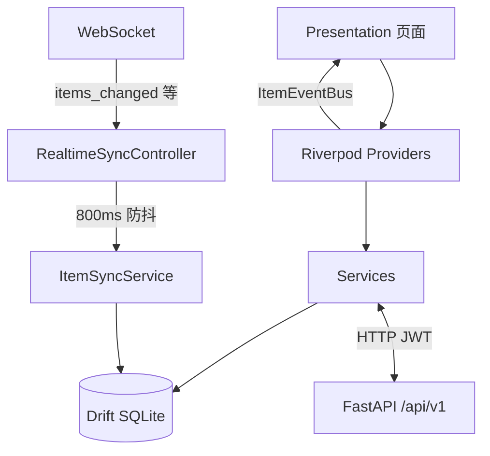

# Flutter 客户端架构

> 对应目录：`HomeWareClient/`。包名 `home_stock`，产品名 HomeStock / 家庭物品管家。  
> 核心流程图见 [core/business-flows.md](../core/business-flows.md)。

---

## 一、技术栈

| 类别 | 选型 |
|------|------|
| 框架 | Flutter 3.x + Dart |
| 状态管理 | flutter_riverpod |
| 路由 | go_router（单页首页 + push 二级页） |
| 本地数据库 | Drift（SQLite via drift_sqflite） |
| 模型 | drift 表 + 部分 freezed/json |
| HTTP | `http` + 统一 `ApiService`（JWT Bearer） |
| 代码生成 | build_runner（drift_dev、freezed 等） |

---

## 二、目录结构

```
lib/
├── main.dart
├── core/
│   ├── config/app_env.dart       # API_BASE_URL、WS URI
│   ├── constants/                # 颜色、间距、圆角
│   ├── router/app_router.dart    # 全部路由
│   ├── providers/                # Riverpod Provider
│   ├── services/                 # API 封装、同步、上传
│   ├── assistant/                # 问管家规则引擎
│   ├── events/                   # ItemEventBus
│   └── utils/
├── data/database/                # Drift 定义与 DAO
└── presentation/                 # 按功能划分的页面与组件
    ├── auth/ home/ items/ alerts/
    ├── profile/ locations/ shopping/
    ├── statistics/ search/ assistant/
    └── common/widgets/
```

> **注意**：早期 Phase 文档中的 `domain/`、`usecases/`、Clean Architecture **未采用**。

---

## 三、导航与路由

### 主入口：单页首页（无底部 Tab）

2026-06-30 起，主入口 `/` 为**单页滚动首页**，各功能通过 `context.push` 进入：

| 路径 | 页面 | 入口 |
|------|------|------|
| `/` | 首页 | 启动默认 |
| `/items` | 物品列表 | 首页分区 / 空间 Chip |
| `/alerts` | 提醒中心 | 首页 Banner / 顶栏 |
| `/profile` | 个人中心 | 首页顶栏头像 |
| `/assistant` | 问管家 | 首页顶栏图标 |

### 添加物品

```
首页/顶栏「+」→ /items/add/method → 扫码 / 手动 → /items/add 向导
物品列表 FAB → /items/add（直达向导）
```

### 路由表

完整路由见 `core/router/app_router.dart`（40+ 路由）。文字版线框见 [design/information-architecture.md](../design/information-architecture.md)。

---

## 四、数据流

### 本地优先 + 服务端同步



| 场景 | 数据源 | 说明 |
|------|--------|------|
| 登录 / 家庭 / 用户资料 | 服务端 API | |
| 创建/更新物品 | API → Drift | 先上传图片 |
| 物品列表 | Drift（同步后） | 离线可读 |
| 提醒中心 | Drift 本地计算 | `getAlertsForDisplay()` |
| 首页统计/分区 | API + 本地 | `homeSectionsProvider` |
| 问管家 | Drift 本地 | 纯规则，无 LLM |

### 关键类

| 类 | 职责 |
|----|------|
| `ApiService` | JWT 存储、401 refresh、请求拦截 |
| `ItemSyncService` | 全量拉取物品合并到 Drift |
| `UsageRecordSyncService` | 使用记录双向同步 |
| `RealtimeSyncService` | WebSocket 连接与事件分发 |
| `ItemEventBus` | 物品增删改后通知刷新 |
| `UploadService` | 图片上传 `/upload/images` |
| `AssistantParser/Executor` | 问管家意图解析与查询 |

---

## 五、主题系统

默认主题 **`utilityClean`**（清爽工具风），可选 `vividClean`、`cartoon` 皮肤。

| 组件 | 路径 |
|------|------|
| 主题定义 | `core/theme/app_theme.dart` |
| 变体枚举 | `core/theme/app_theme_variant.dart` |
| 颜色 Token | `core/constants/app_colors.dart` |
| 统一组件 | `presentation/common/widgets/app_*.dart` |

规范详见 [design/ui_system.md](../design/ui_system.md)。

---

## 六、环境配置

```powershell
cd HomeWareClient
.\scripts\setup_env.ps1              # localhost
.\scripts\setup_env.ps1 -Platform android
.\scripts\run_dev.ps1
```

`config/env.local.json` 中的 `API_BASE_URL` 在启动时由 `app_env.dart` 读取。

---

## 七、与归档 Phase 文档的差异

| 归档文档描述 | 现行实现 |
|-------------|----------|
| 5 Tab + 中心录入 | 单页首页 + 顶栏/FAB「+」 |
| 4 Tab ShellRoute | 无底部 Tab，push 导航 |
| 图片仅存本地路径 | 上传服务端 + URL 存 Drift |
| riverpod code generation 为主 | 手写 Provider 为主 |

历史任务书见 [`archive/client-phase-specs/`](../archive/client-phase-specs/)。
