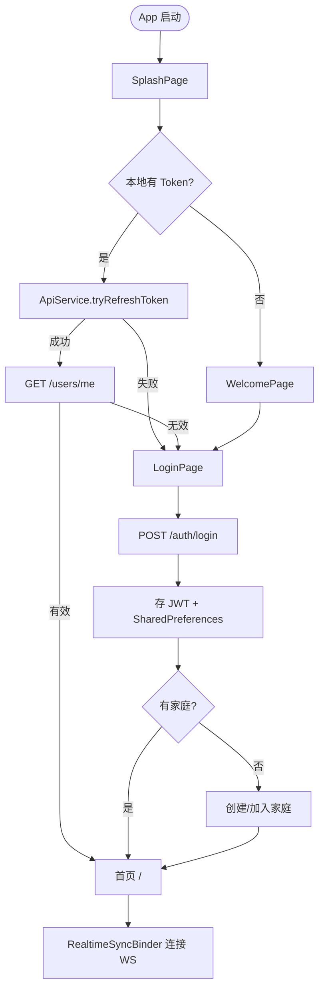
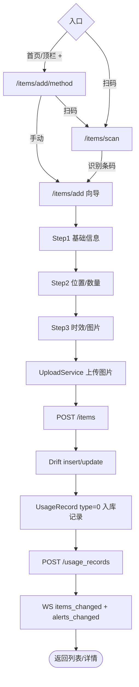
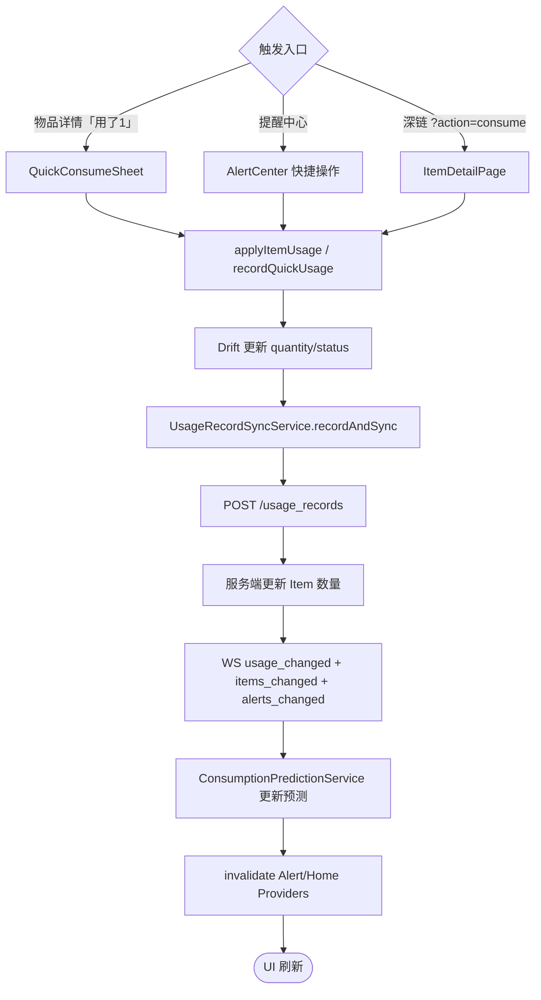
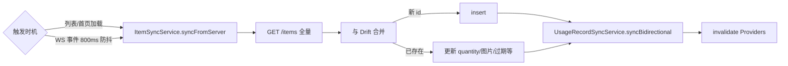
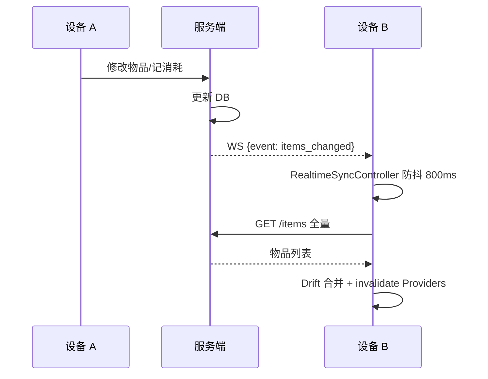
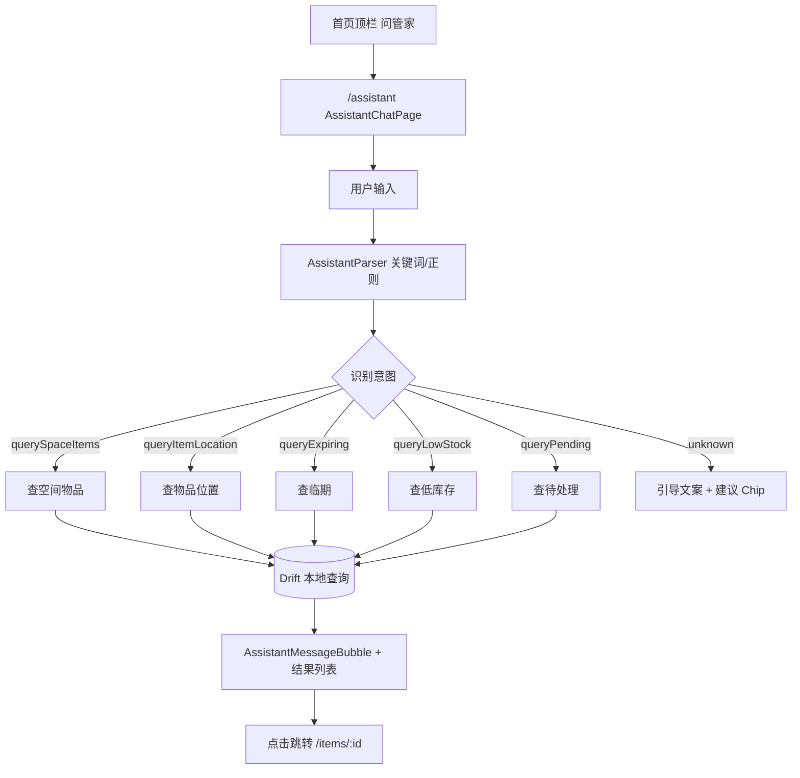
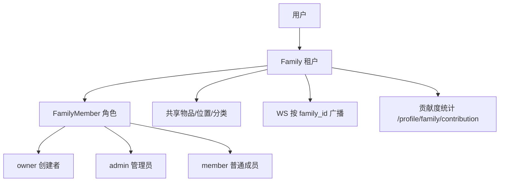

# 核心业务流程

> **状态**：现行真源（2026-07-04）。每个流程标注关键类与 API。  
> 系统架构见 [system-overview.md](system-overview.md)。

---

## 1. 认证与启动



| 步骤 | 关键文件 |
|------|----------|
| Token 校验 | `core/services/api_service.dart` |
| 认证状态 | `core/providers/auth_provider.dart` |
| 401 自动登出 | `core/providers/auth_guard.dart` |
| 服务端 | `app/api/v1/auth.py` |

**占位**：验证码登录、忘记密码为 Mock（验证码 `123456`）。

---

## 2. 添加物品



| 步骤 | 关键文件 |
|------|----------|
| 向导页 | `presentation/items/add_item_page.dart` |
| 方式选择 | `presentation/items/add_item_method_page.dart` |
| 物品 API | `core/services/item_service.dart` |
| 服务端 | `app/api/v1/items.py` |

**录入路径目标**：扫码 → 确认 → 完成，≤ 15 秒（Phase A M5 持续优化）。

---

## 3. 消耗 / 使用记录



| 类型 | UsageRecord.type | 说明 |
|------|------------------|------|
| 入库 | 0 | 添加物品时自动创建 |
| 消耗 | 1 | 用户「用了 N」 |
| 丢弃 | 2 | 过期丢弃 |

**注意**：客户端走 `POST /usage_records`，未直接调用 `POST /items/{id}/use`。

---

## 4. 数据同步

### 4.1 下行同步（全量合并）



### 4.2 WebSocket 实时同步



| 事件 | 触发动作 |
|------|----------|
| `items_changed` | ItemSync + invalidate |
| `usage_changed` | UsageSync + invalidate |
| `alerts_changed` | invalidate Alert Providers |
| `ping` | 客户端回 `pong` |

**关键文件**：
- 客户端：`core/services/realtime_sync_service.dart`、`core/providers/realtime_sync_provider.dart`
- 服务端：`app/api/v1/ws.py`、`app/services/realtime_broadcast.py`

**未接**：`GET /sync/changes?since=` 增量同步（服务端已实现）。

---

## 5. 提醒与通知

```mermaid
flowchart TD
  subgraph calc [提醒计算]
    drift[Drift getAlertsForDisplay]
    celery[Celery 定时扫描]
    apiSummary[GET /alerts/expiring|low-stock]
  end

  subgraph display [展示]
    alertCenter["/alerts 提醒中心"]
    homeBanner[首页今日待办 Banner]
    homeSection[首页分区 Feed]
    badge[未读 Badge]
  end

  drift --> alertCenter
  drift --> badge
  apiSummary --> homeBanner
  apiSummary --> homeSection
  celery --> apiSummary

  alertCenter --> action{用户操作}
  action -->|记消耗| flow3[→ 消耗流程]
  action -->|丢弃| discard[recordItemDiscard]
  action -->|加清单| shopping[ShoppingService]
  action -->|已读| markRead[本地 markAllAlertsRead]
```

| 数据源 | 场景 |
|--------|------|
| **Drift 本地** | 提醒中心列表、未读 Badge |
| **服务端 API** | 首页四分区预览、统计摘要 |
| **WS 事件** | 触发重新 sync + invalidate |

提醒 Tab 分类：`all` / `expiry` / `stock` / `restock` / `warranty`。

---

## 6. 问管家（Assistant Phase 1）



| 特性 | 说明 |
|------|------|
| 离线可用 | 纯本地 Drift，无 LLM |
| 不支持写操作 | 引导用户使用「+」或物品详情 |
| 测试 | `test/core/assistant/assistant_parser_test.dart` |

**关键文件**：`core/assistant/assistant_parser.dart`、`assistant_executor.dart`

---

## 7. 家庭协作



角色权限链：`require_member` → `require_admin` → `require_owner`（服务端 `core/dependencies.py`）。

切换家庭：`FamilyService.switchFamily` → 刷新 Token 家庭上下文 → 重连 WS → 全量 sync。

---

## 8. 实现状态速查

| 流程 | 状态 | 备注 |
|------|------|------|
| 密码认证 | ✅ | |
| 添加物品 | ✅ | 含向导 + 扫码 |
| 消耗记录 | ✅ | M2 一键消耗 |
| 全量同步 | ✅ | |
| WS 实时 | ✅ | 需 websockets 包 |
| 提醒闭环 | ✅ | 提醒 → 消耗/丢弃/加清单 |
| 问管家查询 | ✅ | M1 部分 |
| 增量 sync | ⚠️ | API 有，客户端未接 |
| 问管家写操作 | ❌ | 规划中 |
| SMS 验证码 | ⚠️ Mock | |
