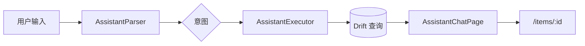

# 模块：问管家（管管）

> **状态**：Phase 1 已上线（2026-07-02）。流程图见 [business-flows.md](../business-flows.md#6-问管家assistant-phase-1)。  
> 云端 LLM 增强见 [roadmap/ai-mode/README.md](../../roadmap/ai-mode/README.md)。

---

## 一、产品定位

**管管**是家庭物品管家的 AI 形象入口，Phase A 里程碑 M1 核心能力：

- 回答「厨房有什么」「牛奶在哪」「什么快过期」等**查询类**问题
- **不支持写操作**（入库、记消耗），引导用户使用「+」或物品详情
- 离线可用，不依赖云端 LLM

---

## 二、技术架构

| 层 | 路径 | 职责 |
|----|------|------|
| 模型 | `core/assistant/assistant_models.dart` | 意图枚举、消息、解析结果 |
| 解析 | `core/assistant/assistant_parser.dart` | 关键词 + 正则 |
| 执行 | `core/assistant/assistant_executor.dart` | Drift 查询 + 文案组装 |
| UI | `presentation/assistant/assistant_chat_page.dart` | 会话页 |
| 组件 | `presentation/assistant/widgets/` | 气泡、结果列表 |
| 测试 | `test/core/assistant/assistant_parser_test.dart` | 解析单测 |

---

## 三、支持意图

| 意图 | 示例 utterance | 数据来源 |
|------|----------------|----------|
| `querySpaceItems` | 厨房有什么 | 空间树 + 使用中物品 |
| `queryItemLocation` | 牛奶在哪 / 还有牛奶吗 | items + location 路径 |
| `queryExpiring` | 什么快过期 | 临期/过期逻辑（同提醒） |
| `queryLowStock` | 库存不足 / 快没了 | safety_stock |
| `queryPending` | 有什么要处理 | 临期 + 低库存汇总 |
| `unknown` | 无法识别 | 引导文案 + 建议 Chip |

---

## 四、入口与路由

| 入口 | 路径 |
|------|------|
| 首页顶栏 🤖 图标 | `/assistant` |
| 路由注册 | `core/router/app_router.dart` |

首页顶栏布局：搜索框 — **问管家** — **+** — 通知 — 头像。

---

## 五、管管 IP 与动效（设计中）

| 项 | 状态 | 文档 |
|----|------|------|
| 角色设定（管管形象、性格） | 设计完成 | `lwh/code_changed/20260703_ai_mascot_character_design.md` |
| hello 序列帧动画 | ✅ 已接入 | 每日首次 `/assistant` 播放；缺 PNG 时图标 fallback |

Phase 1 当前 UI 使用 Material `smart_toy_outlined` 图标；序列帧动效为 M1 增强项。

---

## 六、与提醒/列表的一致性

Executor 复用与提醒中心、物品列表相同的 Drift 查询逻辑，确保：

- 「什么快过期」结果与 `/alerts?tab=expiry` 一致
- 「库存不足」与低库存提醒规则一致

---

## 七、后续规划（未实现）

| 能力 | 说明 |
|------|------|
| 写操作 | 自然语言入库、记消耗 |
| 云端 LLM | `/api/v1/chat` |
| 语音 STT | AI-2 |
| NL 预填入库 | M5 里程碑（规则优先，非 LLM） |

---

## 八、历史变更索引

| 日期 | 文件 |
|------|------|
| 2026-07-02 | `lwh/code_changed/20260702_ai_assistant_phase1_impl.md` |
| 2026-07-03 | `lwh/code_changed/20260703_ai_mascot_character_design.md` |
| 2026-07-03 | `lwh/code_changed/20260703_guanguan_hello_sequence_frames.md` |
| 规划归档 | `lwh/archive/code_changed/20260702_ai_assistant_mvp_plan.md` |
