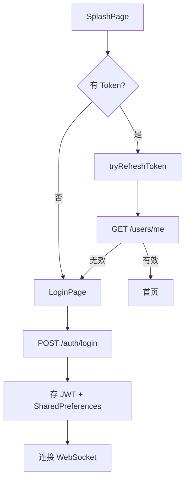
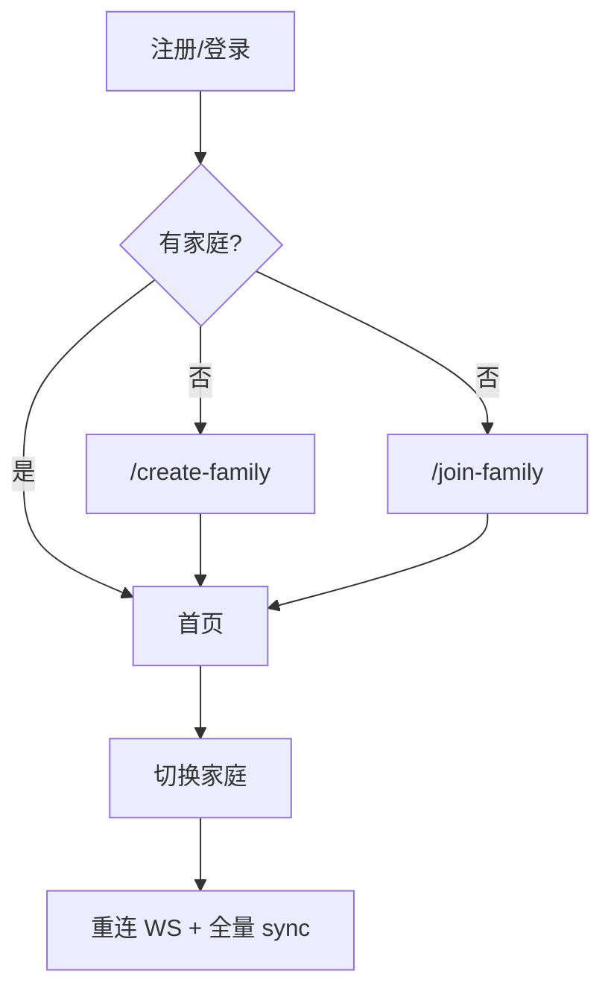

# 模块：认证与家庭协作

> **状态**：现行实现。流程见 [business-flows.md](../business-flows.md#1-认证与启动)。

---

## 一、认证流程

| 组件 | 路径 |
|------|------|
| HTTP 基座 | `core/services/api_service.dart` |
| 认证状态 | `core/providers/auth_provider.dart` |
| 路由守卫 | `core/providers/auth_guard.dart` |
| 401 处理 | refresh 失败 → logout → `/login` |

### 实现状态

| 能力 | 状态 |
|------|------|
| 密码注册/登录 | ✅ 真实 API |
| Token refresh | ✅ |
| 验证码登录 | ⚠️ Mock（123456） |
| 忘记密码 | ⚠️ Mock |
| Session 刷新修复 | ✅ 2026-06-23 |

---

## 二、家庭协作

| API | 说明 |
|-----|------|
| `POST /families` | 创建家庭 |
| `POST /families/join` | 邀请码加入 |
| `POST /families/switch` | 切换当前家庭 |
| `GET /families/members` | 成员列表 |

### 角色权限（服务端）

`require_member` → `require_admin` → `require_owner`

---

## 三、用户面板与贡献度

| 路径 | 页面 | 功能 |
|------|------|------|
| `/profile/panel` | 用户面板 | 切换家庭、邀请码 |
| `/profile/family` | 家庭管理 | 成员、角色 |
| `/profile/family/contribution` | 家庭贡献 | 成员消耗统计 |
| `/profile/family/member` | 成员详情 | 个人贡献明细 |

引入：2026-05-26 用户面板；2026-07-02 贡献度网格修复。

---

## 四、通知与认证联动

- 登录成功后 `RealtimeSyncBinder.connectIfAuthenticated`
- 切换家庭后 Token 内 `current_family_id` 更新，WS 需重连
- 无家庭时不强制 logout（2026-05-28 修复）

---

## 五、历史变更索引

| 日期 | 主题 | 位置 |
|------|------|------|
| 2026-05-25 | 注册 API、用户资料 | `lwh/archive/code_changed/20260525_*.md` |
| 2026-05-26 | 用户面板 | `lwh/archive/code_changed/20260526_user_panel.md` |
| 2026-05-27~28 | 家庭切换/删除 API | `lwh/archive/code_changed/20260527~28_*.md` |
| 2026-06-23 | Session refresh | `lwh/archive/code_changed/20260623_auth_session_refresh_fix.md` |
| 2026-07-01 | 通知/认证 analyze 修复 | `lwh/code_changed/20260701_jk_analyze_fix_auth_notification.md` |
| 2026-07-02 | 贡献度编译/网格修复 | `lwh/code_changed/20260702_fix_member_contribution_*.md` |
