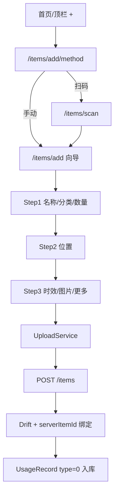
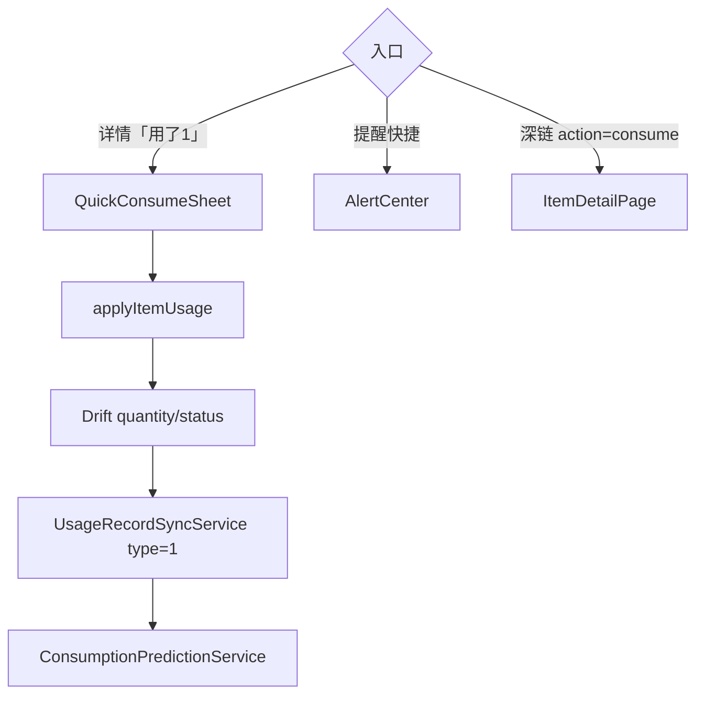
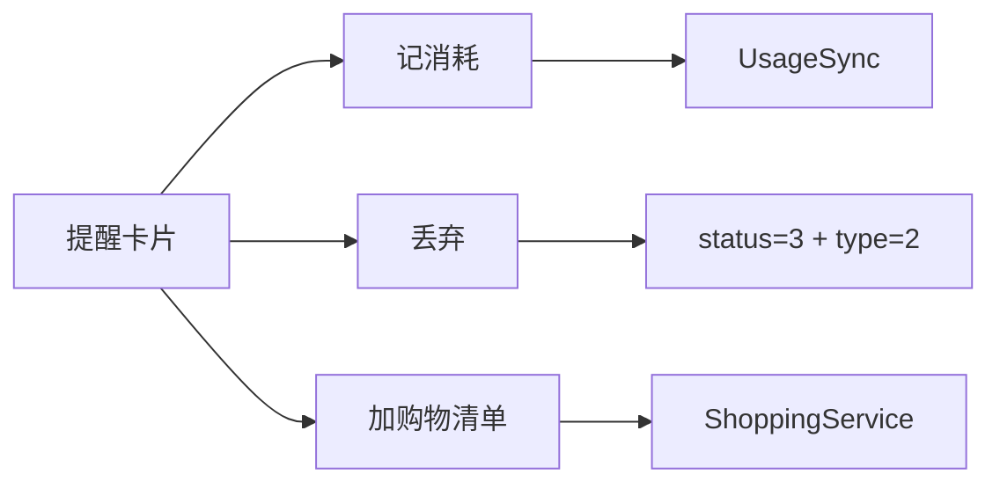

# 模块：物品录入与消耗

> **状态**：现行实现。流程见 [business-flows.md](../business-flows.md#2-添加物品)、[#3 消耗](../business-flows.md#3-消耗--使用记录)。

---

## 一、录入流程

### 关键路径

| 组件 | 路径 |
|------|------|
| 方式选择 | `presentation/items/add_item_method_page.dart` |
| 向导 | `presentation/items/add_item_page.dart`、`add_item_wizard_view.dart` |
| 表单控制 | `item_form_controller.dart` |
| 扫码 | `presentation/items/scan_page.dart` |
| 编辑 | `presentation/items/edit_item_page.dart`（与向导字段对齐） |

### 录入增强

| 能力 | 状态 | 说明 |
|------|------|------|
| 扫码预填 barcode/name | ✅ | query 参数 |
| 草稿恢复 | ✅ | `resumeDraft=1` |
| 预计使用天数 | ✅ | Step4，sync 到服务端 |
| OCR 拍照识别 | ❌ | 决策：端侧 OCR only（`ocr_local_only_decision`） |
| NL 规则预填 | ❌ | M5 待做 |

---

## 二、消耗流程

| 组件 | 路径 |
|------|------|
| 一键消耗 | `widgets/quick_consume_sheet.dart` |
| 消耗逻辑 | `widgets/usage_dialog.dart` |
| M2 里程碑 | `lwh/code_changed/20260703_m2_quick_consume.md` |

**目标**：3 秒内完成一次消耗（Phase A M2 ✅）。

---

## 三、提醒闭环

| 项 | 说明 |
|----|------|
| 提醒数据源 | Drift 本地计算（`getAlertsForDisplay`） |
| 操作人展示 | `operator_id` 同步（2026-07-01） |
| 家庭贡献 | 消耗计入成员贡献度 |

相关：`lwh/code_changed/20260701_f_alert_consume_loop_operator.md`

---

## 四、物品 ID 与 API

所有写 API 使用 `item.serverApiId`（见 [sync-and-realtime.md](sync-and-realtime.md#四itemidresolver本地服务端-id-映射)）。

| 操作 | API |
|------|-----|
| 创建 | `POST /items` |
| 更新 | `PUT /items/{serverApiId}` |
| 消耗 | `POST /usage_records`（非 `/items/{id}/use`） |
| 丢弃 | 本地 status + usage type=2 + PUT item |

---

## 五、列表与卡片

| 能力 | 说明 |
|------|------|
| 多视图 | 列表/网格切换 |
| 分页 | 本地 Drift 分页 |
| 理由优先标签 | 临期、低库存、已过期（`AppReasonTag`） |
| 统一卡片 | `item_card.dart` + `AppCard` 体系 |

UI 规范见 [design/ui_system.md](../../design/ui_system.md)。

---

## 六、历史变更索引

| 日期 | 主题 | 位置 |
|------|------|------|
| 2026-05-28 | 物品详情、图片上传 | `lwh/archive/code_changed/` |
| 2026-06-22 | 添加物品 Phase C 向导 | `lwh/archive/code_changed/20260622_add_item_phase_c.md` |
| 2026-07-01 | 向导字段补全、编辑对齐 | `lwh/code_changed/20260701_o_*.md`, `20260701_l_*.md` |
| 2026-07-02 | 保存/日期选择器修复 | `lwh/code_changed/20260702_add_item_save_and_datepicker_fix.md` |
| 2026-07-03 | M2 一键消耗 | `lwh/code_changed/20260703_m2_quick_consume.md` |
