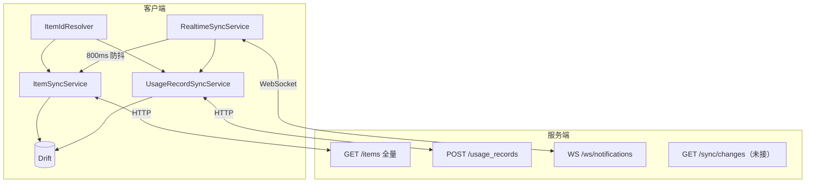
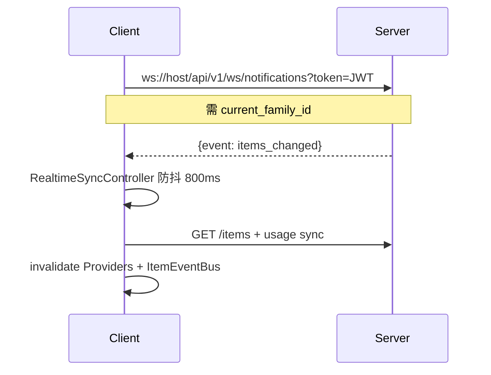

# 模块：数据同步与实时推送

> **状态**：现行实现（2026-07-04）。流程总览见 [business-flows.md](../business-flows.md#4-数据同步)。

---

## 一、架构概览

**策略**：客户端采用**全量拉取合并**，非增量 sync。服务端 `/sync/changes`、`/sync/push` 已实现但客户端未接入。

---

## 二、ItemSyncService（物品下行）

| 项 | 说明 |
|----|------|
| 路径 | `core/services/item_sync_service.dart` |
| 触发 | 列表/首页加载前；WS 事件后（防抖） |
| 逻辑 | `GET /items` 全量 → 本地不存在则 insert；已存在则合并 quantity/图片/过期/预测字段 |
| 映射 | 插入时写入 `serverItemId`；`Item.serverApiId` = `serverItemId ?? id` |

### 预测字段同步（2026-07-02）

`avgDailyConsumption`、`predictedEmptyDate`、`estimatedUseDays` 在 sync 时合并，不再写 `Value.absent()`。映射见 `core/utils/item_server_mapper.dart`。

---

## 三、UsageRecordSyncService（使用记录双向）

| 项 | 说明 |
|----|------|
| 路径 | `core/services/usage_record_sync_service.dart` |
| 顺序 | 先 `ItemSyncService.syncFromServer()`，再拉/推 usage |
| 推送 | `ItemIdResolver.toServerId(localId)` → `POST /usage_records` |
| 拉取 | `toLocalId(serverItemId)`，无映射则 WARN 跳过 |

### UsageRecord 类型

| type | 含义 | 触发 |
|------|------|------|
| 0 | 入库 | 添加物品成功 |
| 1 | 消耗 | 「用了 N」/ QuickConsume |
| 2 | 丢弃 | 过期丢弃 |

**注意**：客户端**不**直接调用 `POST /items/{id}/use`，统一走 usage_records。

---

## 四、ItemIdResolver（本地/服务端 ID 映射）

**背景**（2026-07-01）：历史本地自增 id 与服务端 id 不一致会导致 usage 同步失败。

| 组件 | 说明 |
|------|------|
| Drift 列 | `items.server_item_id`（schema v4，可空） |
| 解析 | `resolveServerItemId` / `resolveLocalId` |
| 绑定 | 创建/同步成功后 `ItemIdResolver.bind` |

**API 调用统一用** `item.serverApiId`：编辑、详情状态变更、丢弃、拉服务端详情。

---

## 五、WebSocket 实时同步

| 事件 | 客户端动作 |
|------|------------|
| `items_changed` | ItemSync + invalidate |
| `usage_changed` | UsageSync + invalidate |
| `alerts_changed` | invalidate Alert Providers |
| `ping` | 回 `{event: pong}` |

| 文件 | 职责 |
|------|------|
| `core/services/realtime_sync_service.dart` | WS 连接、重连（2s~30s 退避） |
| `core/providers/realtime_sync_provider.dart` | RealtimeSyncBinder 绑定登录态 |
| 服务端 `app/api/v1/ws.py` | JWT 鉴权、家庭频道 |
| 服务端 `realtime_broadcast.py` | 物品/usage 变更广播 |

**依赖**：Python 包 `websockets`（2026-07-02 修复握手问题）。

---

## 六、ItemEventBus

| 项 | 说明 |
|----|------|
| 路径 | `core/events/item_event_bus.dart` |
| 用途 | 物品增删改后通知列表/详情/首页刷新 |
| 引入 | 2026-05-29 |

---

## 七、服务端 API 摘要（同步相关）

| 端点 | 状态 | 说明 |
|------|------|------|
| `GET /items` | ✅ 客户端使用 | 全量列表，含 preview_image |
| `GET /usage_records` | ✅ | 支持全家庭分页 + item_name |
| `POST /usage_records` | ✅ | 客户端写操作主路径 |
| `GET /sync/changes?since=` | ⚠️ 未接客户端 | 增量变更 |
| `POST /sync/push` | ⚠️ 未接客户端 | 批量推送 |

---

## 八、operator_id 同步（2026-07-01）

使用记录推送携带 `operator_id`（当前用户），用于家庭贡献度与「最后操作人」展示。

---

## 九、历史变更索引

| 日期 | 主题 | 归档路径 |
|------|------|----------|
| 2026-05-29 | ItemEventBus | `lwh/archive/code_changed/20260529_item_event_bus.md` |
| 2026-06-04 | preview_image、usage 分页 API | `lwh/archive/code_changed/20260604_api_sync_docs.md` |
| 2026-07-01 | serverItemId 映射 | `lwh/code_changed/20260701_p_item_id_mapping.md` |
| 2026-07-01 | operator_id | `lwh/code_changed/20260701_m_usage_sync_operator_id.md` |
| 2026-07-02 | 消耗预测字段 sync | `lwh/code_changed/20260702_phase_d_consumption_sync_impl.md` |
| 2026-07-02 | WS 依赖/握手修复 | `lwh/code_changed/20260702_ws_*.md` |
