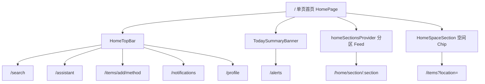

# 模块：UI 体系与首页

> **状态**：现行实现。UI 规范真源：[design/ui_system.md](../../design/ui_system.md)。

---

## 一、UI 体系

### 默认主题：utilityClean

| Token | 值 | 用途 |
|-------|-----|------|
| `primary` | `#FF6633` | 链接、筛选、次要 CTA |
| `accentHighlight` | `#FFDA44` | **仅** FAB、首页「+」 |
| `scaffoldBackground` | `#F5F5F5` | 页面底 |

可选皮肤：`vividClean`、`cartoon`（实验性，非默认）。

### 统一组件（`presentation/common/widgets/app_*.dart`）

| 组件 | 用途 |
|------|------|
| `AppCard` | 白卡片容器 |
| `AppListRow` | 设置项、功能入口 |
| `AppReasonTag` | 理由优先标签（临期/低库存） |
| `AppSegmentChip` | 筛选 Chip |
| `WarmScaffold` | 二级页标准壳 |

**禁止**：工具风页面使用卡通贴纸、随机倾斜卡片。

### 演进时间线

| 阶段 | 说明 |
|------|------|
| 2026-06-22 | 青松 Teal 实验 → **已废弃** |
| 2026-06-23~25 | cartoon 主题实验 → **已废弃** |
| 2026-07-01 | utilityClean 对标大众点评/闲鱼 |
| 2026-07-02 | UI 体系统一 Phase 1+2 |

---

## 二、首页架构



### 结构（2026-06-30 起）

1. **顶栏固定**：家庭名 + 搜索 + 问管家 + + + 通知 + 头像
2. **今日待办 Banner**：临期/低库存摘要 → `/alerts`
3. **分区 Feed**：需要关注、临期、低库存等 → `/home/section/:section`
4. **空间 Chip**：厨房、卫生间等 → `/items?location=`
5. **整页滚动**，无底部 Tab

M3 里程碑：空间 Chip 快捷入口 ✅（`20260703_m3_home_scene_chips.md`）

---

## 三、录入入口（闲鱼式）

```
首页/顶栏「+」→ /items/add/method
  ├── 扫码 → /items/scan
  └── 手动 → /items/add 向导
```

黄色 `#FFDA44` 仅用于「+」FAB，全站唯一主操作色。

---

## 四、个人中心

| 路径 | 功能 |
|------|------|
| `/profile` | 功能列表入口 |
| `/profile/theme-settings` | 主题切换 |
| `/profile/notification-settings` | 提醒偏好 |
| `/profile/inventory` | 盘点任务（占位） |
| `/profile/categories` | 分类管理 |

2026-07-02 Profile UI 重设计 + 创意增强（贡献度、统计卡片）。

---

## 五、通知中心

| 路径 | 说明 |
|------|------|
| `/notifications` | Epic E1 ✅，全屏二级页 |
| Badge | 与提醒共用 `unreadAlertCountProvider` |

---

## 六、历史变更索引

| 日期 | 主题 | 位置 |
|------|------|------|
| 2026-05-29 | 品牌名/icon | `lwh/archive/code_changed/20260529_*.md` |
| 2026-06-22 | 通知中心 impl | `lwh/archive/code_changed/20260622_notification_center_impl.md` |
| 2026-06-30 | 单页首页分区 | `lwh/code_changed/20260630_home_single_page_sections.md` |
| 2026-07-01 | utilityClean 主题 | `lwh/code_changed/20260701_abcd_theme_unification.md` |
| 2026-07-02 | UI 体系统一 | `lwh/code_changed/20260702_ui_system_unification*.md` |
| 2026-07-03 | M3 空间 Chip | `lwh/code_changed/20260703_m3_home_scene_chips.md` |
| 主题实验归档 | cartoon/glass/neumorphism | `lwh/archive/code_changed/20260623~25_*.md` |
