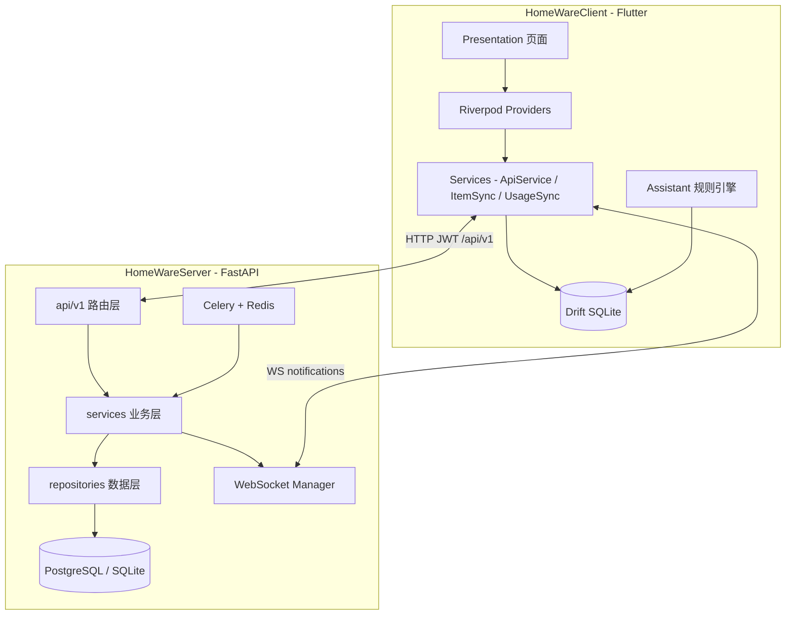
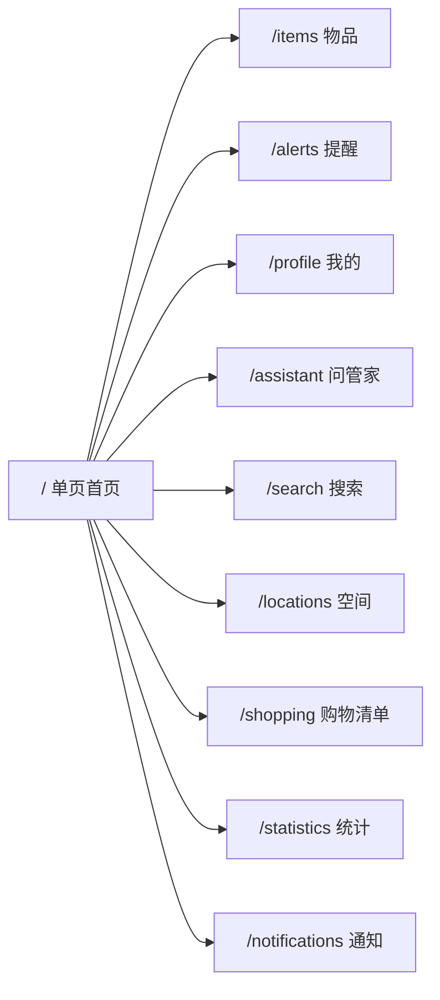
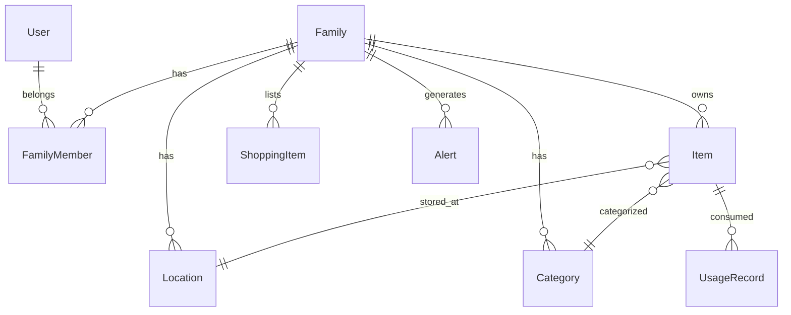

# 系统总览

> **状态**：现行真源文档（2026-07-04），与代码对齐。  
> 详细流程见 [business-flows.md](business-flows.md)；客户端/服务端架构见 [client/architecture.md](../client/architecture.md)、[server/architecture.md](../server/architecture.md)。

---

## 一、产品定位

**HomeStock（家庭物品管家）** — 帮助家庭用户回答四个核心问题：

| 问题 | 产品能力 |
|------|----------|
| 家里有什么？ | 物品列表、搜索、按空间/分类筛选 |
| 在哪里？ | 多级位置树、物品详情位置路径 |
| 还剩多少 / 还能用多久？ | 库存数量、消耗记录、预测 |
| 要不要处理？ | 临期/低库存提醒、今日待办、问管家 |

当前产品方向：**Phase A 主攻家庭场景**（详见 [product/current-phase.md](../product/current-phase.md)）。

---

## 二、技术架构

### 核心设计原则

| 原则 | 说明 |
|------|------|
| **本地优先** | UI 主要读 Drift；离线可读已同步数据 |
| **写后同步** | 创建/消耗先写本地，再推 API；失败可重试 |
| **全量合并** | 客户端 `ItemSyncService` 全量拉取合并（非增量 `/sync/changes`） |
| **实时广播** | 服务端变更经 WebSocket 通知同家庭其他设备 |
| **三层分离（服务端）** | Route → Service → Repository，业务逻辑不进路由 |

---

## 三、模块地图

### 客户端（`HomeWareClient/lib/`）

| 模块 | 路径 | 职责 |
|------|------|------|
| 路由 | `core/router/app_router.dart` | 全部 GoRouter 路由 |
| HTTP | `core/services/api_service.dart` | JWT、401 刷新、统一请求 |
| 物品同步 | `core/services/item_sync_service.dart` | 全量下行合并 |
| 使用记录 | `core/services/usage_record_sync_service.dart` | 双向同步 |
| 实时 | `core/services/realtime_sync_service.dart` | WebSocket 连接 |
| 问管家 | `core/assistant/` | 规则解析 + 本地查询 |
| 本地库 | `data/database/app_database.dart` | Drift 表 + 提醒计算 |
| 页面 | `presentation/*/` | 按功能划分 |

### 服务端（`HomeWareServer/app/`）

| 模块 | 路径 | 职责 |
|------|------|------|
| 路由注册 | `api/router.py` | 挂载全部 v1 模块 |
| 认证 | `api/v1/auth.py` | JWT 注册/登录/刷新 |
| 物品 | `api/v1/items.py` | CRUD、use/finish/discard |
| 同步 | `api/v1/sync.py` | 增量 changes/push（客户端暂未接） |
| WebSocket | `api/v1/ws.py` | 家庭级事件广播 |
| 提醒 | `api/v1/alerts.py` + `tasks/` | API + Celery 定时扫描 |
| 广播 | `services/realtime_broadcast.py` | WS 事件发送 |

---

## 四、导航模型（现行）

> ⚠️ **2026-06-30 起**：主入口为**单页首页**，**无底部 Tab 栏**。各功能页通过 `context.push` 进入。

首页结构：顶栏（家庭名 + 搜索 + 问管家 + 添加）→ 今日待办 Banner → 分区 Feed（临期/低库存等）→ 空间 Chip 快捷入口。

---

## 五、数据模型（概念）

- **Family** 为租户隔离单元（一个家庭 = 一个空间）
- **Item** 含数量、过期日、安全库存、状态（使用中/已用完/已丢弃）
- **UsageRecord** 记录入库(type=0)、消耗(type=1)、丢弃(type=2)
- **Alert** 客户端主要在 Drift 本地计算；服务端 Celery 扫描 + API 摘要

---

## 六、已实现 vs 规划中

| 能力 | 状态 | 说明 |
|------|------|------|
| 密码登录/注册/Token 刷新 | ✅ | 真实 API |
| 创建/加入/切换家庭 | ✅ | |
| 物品 CRUD + 图片上传 | ✅ | |
| 扫码录入 + 分步向导 | ✅ | `/items/add/method` |
| 一键消耗 | ✅ | 物品详情 + QuickConsumeSheet |
| 使用记录双向同步 | ✅ | `POST /usage_records` |
| WebSocket 多设备同步 | ✅ | 800ms 防抖全量拉取 |
| 问管家 Phase 1 | ✅ | 本地规则，5 类查询意图 |
| 提醒中心 | ✅ | 本地 Drift 计算为主 |
| 通知中心 | ✅ | `/notifications` |
| 首页空间 Chip | ✅ | M3 里程碑 |
| 验证码/SMS 登录 | ⚠️ Mock | 硬编码 123456 |
| 增量 sync API | ⚠️ | 服务端有，客户端未接 |
| 问管家 LLM / 写操作 | ❌ | Phase A 后续 |
| 购物清单显示现有量 | ❌ | M4 待做 |
| 店铺皮肤 (Phase B) | ❌ | 远期 |

---

## 七、相关文档

| 文档 | 内容 |
|------|------|
| [modules/](modules/) | **模块专题**：同步、问管家、录入、认证、UI |
| [business-flows.md](business-flows.md) | 端到端业务流程图 |
| [product/current-phase.md](../product/current-phase.md) | Phase A 范围与里程碑 |
| [product/roadmap.md](../product/roadmap.md) | 功能交付状态 |
| [design/ui_system.md](../design/ui_system.md) | UI 规范（utilityClean） |
| [design/information-architecture.md](../design/information-architecture.md) | 路由与页面结构 |
| [lwh/code_changed/](../../lwh/code_changed/) | 2026-06-30 及以后的变更记录 |
| [lwh/archive/code_changed/](../../lwh/archive/code_changed/) | 历史变更记录 |
