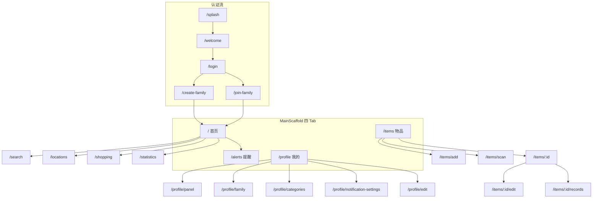

# 信息架构与文字版效果图

> **现行版本**（2026-06-22），对齐 `HomeWareClient/lib/core/router/app_router.dart`。  
> 旧版 5 Tab 线框见 [`archive/prototype-wireframes-v1.md`](../archive/prototype-wireframes-v1.md)。  
> UX 评审依据：ui-ux-pro-max（Flutter / Material 3 规范）。

---

## 一、全局导航

### 底部 Tab（4 个）

```
┌──────────┬──────────┬──────────┬──────────┐
│   首页    │   物品   │  提醒 ●  │   我的   │
│   🏠     │   📋     │   🔔     │   👤     │
└──────────┴──────────┴──────────┴──────────┘
```

- 提醒 Tab 显示未读 Badge（`alertCountProvider`）
- **添加物品**：物品页右下角 FAB → `/items/add`（非 Tab 中间「＋」）
- Tab 数量 ≤ 5，符合移动端主导航最佳实践（ui-ux-pro-max P9）

### 启动与认证流

```
Splash → Welcome（首次）→ Login/Register → Create/Join Family → 主 Tab
                ↓
         Verify Code / Forgot Password（按需）
```

| 路径 | 页面 | 说明 |
|------|------|------|
| `/splash` | 启动页 | 检查登录态 |
| `/welcome` | 欢迎引导 | 仅首次 |
| `/login` | 登录 | |
| `/register` | 注册 | |
| `/verify-code` | 验证码 | 注册/找回流程 |
| `/forgot-password` | 忘记密码 | |
| `/create-family` | 创建家庭 | 无家庭时强制 |
| `/join-family` | 加入家庭 | 邀请码 |

---

## 二、站点地图



---

## 三、首页 `/`

```
┌─────────────────────────────────────────┐
│ 🏠 {家庭名}              🔍  🔔●  [头像] │
│─────────────────────────────────────────│
│  ⚠️ 需要关注                             │
│  ┌─────────────┐ ┌─────────────┐        │
│  │🔴 即将过期   │ │📦 库存不足   │ → 提醒 │
│  └─────────────┘ └─────────────┘        │
│  ┌─────────────┐ ┌─────────────┐        │
│  │🛒 待购清单   │ │📊 本月消费   │ → 清单/统计│
│  └─────────────┘ └─────────────┘        │
│  📍 快捷查看（横向空间卡片）              │
│  📅 最近动态                             │
├─────────────────────────────────────────┤
│ [首页] │  物品  │  提醒  │  我的          │
└─────────────────────────────────────────┘
```

**入口**：🔍→搜索 · 头像→用户面板 · 空间卡片→位置详情 · 统计卡片→`/statistics` · 待购→`/shopping`

**UX 备注**：AppBar 🔔 已接入 `/notifications` 通知中心，Badge 与提醒 Tab 共用 `unreadAlertCountProvider`。

---

## 四、物品 `/items`

```
┌─────────────────────────────────────────┐
│  🔍 搜索物品名称、品牌...                │
│  (全部)(使用中)(已用完)(已过期)(已丢弃)   │
│  ┌─────────────────────────────────┐    │
│  │ 🖼️ 物品名 · 位置 · 数量 · 过期   │    │
│  └─────────────────────────────────┘    │
│                              [FAB +]    │
├─────────────────────────────────────────┤
│  首页  │ [物品] │  提醒  │  我的          │
└─────────────────────────────────────────┘
```

- FAB 触控目标 ≥ 48dp（Material），与底部 Tab 保持安全间距
- 筛选 Chip 横向滚动，避免单行溢出导致横向整页滚动

---

## 五、物品详情 `/items/:id`

```
┌─────────────────────────────────────────┐
│ ←  物品详情                    ✏️  ⋮    │
│  [图片轮播 + 全屏/下载]                  │
│  名称 · 分类 · 品牌                      │
│  状态总览（剩余/过期/消耗）+ 进度条       │
│  详细信息（位置、价格、日期、提醒）       │
│  使用记录时间线                          │
│─────────────────────────────────────────│
│ [使用1件]  [已用完]  [再次购买]          │
└─────────────────────────────────────────┘
```

- 底部三按钮为高频操作，需保证 44×44pt 最小点击区域
- 状态色遵循 [design-system.md](design-system.md)（success / warning / danger），不仅靠颜色区分（过期需配合文案/图标）

---

## 六、添加物品 `/items/add`

分区表单：物品图片 → 基本信息 → 购买信息 → 时效 → 存放位置（含位置照片）→ 提醒 → 备注。  
底部：**保存入库** / **保存并继续**。

扫码 `/items/scan`：相机取景 → 跳转添加页并填充 barcode。

**渐进式录入**（对齐 [vision.md](../product/vision.md)）：必填仅名称 + 分类；过期/位置可后补。保存中按钮应禁用并显示 loading（ui-ux-pro-max P2）。

---

## 七、提醒 `/alerts`

Tab：**全部 | 过期 | 库存 | 补购 | 其他**。  
卡片操作：使用 / 丢弃 / 加入购物清单 / 忽略。

- 卡片内操作按钮较多，需 8dp+ 间距防误触
- 操作结果通过 SnackBar 反馈（已实现）

---

## 八、我的 `/profile`

个人信息卡片 + 功能列表：空间管理、分类、家庭成员、统计、购物清单、提醒设置、导出、关于。

用户面板 `/profile/panel`：切换家庭、贡献度、邀请码。  
「盘点任务」菜单项为占位（`route: null`），见 roadmap Epic E3。

---

## 九、全屏二级页（无底部 Tab）

| 路径 | 页面 |
|------|------|
| `/search` | 搜索 |
| `/locations` | 空间总览 |
| `/locations/:id` | 位置详情 |
| `/shopping` | 购物清单（待购/已购/历史） |
| `/statistics` | 数据统计 |
| `/profile/panel` | 用户面板（切换家庭） |
| `/profile/edit` | 编辑资料 |
| `/profile/family` | 家庭成员 |
| `/profile/categories` | 分类管理 |
| `/profile/notification-settings` | 提醒设置 |
| `/items/:id/edit` | 编辑物品 |
| `/items/:id/records` | 使用记录 |
| `/notifications` | 通知中心（Epic E1 ✅） |

二级页统一使用 `SlideTransitionPage`（300ms），返回行为可预测（ui-ux-pro-max P9）。

---

## 十、核心用户旅程

| 场景 | 路径 | 目标时长 |
|------|------|----------|
| 扫码入库 | 物品 Tab → FAB / 扫码 → 确认 → 保存 | ≤ 15s |
| 找物品 | 首页/物品页 🔍 → 结果 → 详情 → 看位置 | ≤ 10s |
| 处理过期 | 提醒 Tab → 卡片 → 使用/丢弃/加入清单 | ≤ 5s/条 |
| 补货规划 | 首页待购卡片 → 购物清单 → 勾选/分享 | ≤ 30s |
| 切换家庭 | 头像 → 用户面板 → 切换 | ≤ 8s |

---

## 十一、UX 质量清单（评审用）

按 ui-ux-pro-max 优先级，对现行 IA 的自查项：

| 优先级 | 类别 | 现状 | 建议 |
|--------|------|------|------|
| P1 | 无障碍 | 状态依赖颜色（红橙绿） | 过期/库存卡片保留图标 + 文案，不仅靠色 |
| P1 | 触控 | FAB、详情底栏、提醒卡片多按钮 | 实测 ≥ 44dp，Chip 间距 ≥ 8dp |
| P2 | 性能 | 列表较长 | 物品列表考虑虚拟滚动（50+ 条） |
| P2 | 表单 | 添加页字段多 | 分区折叠/渐进必填，见 vision「渐进式信息收集」 |
| P3 | 动效 | Tab 200ms / 二级页 300ms | 已对齐 design-system，保持 |
| P3 | 导航 | 4 Tab + 深链路由 | GoRouter 路径完整，支持分享链接（待产品验证） |

---

## 十二、路由真源

```82:293:HomeWareClient/lib/core/router/app_router.dart
final appRouter = GoRouter(
  initialLocation: '/splash',
  routes: [
    // 认证、ShellRoute 四 Tab、全屏二级页 …
  ],
);
```

---

## 十三、界面截图

PNG 参考：`doc/image/`（首页、物品列表、详情、空间、筛选、购物清单、扫码流程等）。

---

## 相关文档

- [auth-onboarding.md](auth-onboarding.md) — 登录注册线框
- [profile-and-family.md](profile-and-family.md) — 用户面板与家庭
- [switch-family-sheet.md](switch-family-sheet.md) — 切换家庭弹窗
- [design-system.md](design-system.md) — 颜色与组件
- [roadmap.md](../product/roadmap.md) — UX 债务与下一阶段 Epic
