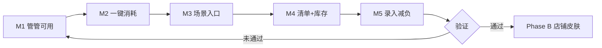

# Phase A 产品方向（现行）

> **状态**：已确认（2026-07-03），所有功能 PRD 默认读者为「家庭用户」。  
> 完整愿景见 [vision.md](vision.md)；交付状态见 [roadmap.md](roadmap.md)。

---

## 决策结论

| 项目 | 选择 |
|------|------|
| **Phase A 主攻** | 家庭物品管理 |
| **Phase B 扩展** | 小店铺 / 轻量库存（`space_type=shop` 皮肤） |
| **原则** | 一套内核，不换 App；先让家庭用户**每天用得上** |

**不采用**：家庭与小店两条线并行、两套 UI、两套数据模型。

---

## 北极星

> 用户能在 **10 秒内** 回答：家里某样东西 **在哪、还剩多少、要不要处理**。

---

## Phase A 范围

### In Scope

| # | 能力 | 状态 | 说明 |
|---|------|------|------|
| A1 | **问管管** | 🟡 进行中 | 查询类 + 管管形象；写操作引导到「+」 |
| A2 | **一键消耗** | ✅ 已完成 | 物品详情「用了 1」 |
| A3 | **场景入口** | ✅ 已完成 | 首页空间 Chip / 厨房聚合 |
| A4 | **清单带库存** | ❌ 待做 | 购物清单旁显示「现有 x」 |
| A5 | **临期/低库存闭环** | ✅ 基本完成 | 提醒 → 处理 → 可选加清单 |
| A6 | **录入减负** | 🟡 进行中 | 扫码 + 向导；NL 预填（规则优先） |

### Out of Scope（Phase B 及以后）

- 售价 / 日销 / 毛利报表
- CSV 批量导入导出
- `space_type=shop` onboarding
- 供应商 / 采购分单
- 完整 ERP / 收银对接

---

## 里程碑

| 里程碑 | 交付 | 验收 | 状态 |
|--------|------|------|------|
| M1 | 管管查询 + 首页入口 + hello 序列帧 | 5 类问题有结果 | 🟡 Phase 1 规则引擎已上线 |
| M2 | 物品详情「用了 1」 | 3 秒内完成消耗 | ✅ |
| M3 | 首页空间 Chip / 厨房聚合 | 少点 2 次进列表 | ✅ |
| M4 | 购物清单显示现有量 | 采购前不重复买 | ❌ |
| M5 | 规则 NL 预填入库 | 一句话进向导 | ❌ |

---

## Phase B 启动条件

满足 **任一** 再开店铺线：

- 家庭空间 ≥10 个真实物品的活跃用户占比达标（如 30%）
- 小店主误用家庭版且愿付费的明确需求
- M1～M4 已 ship 且 2 周无 P0 bug

---

## 研发约定

> 代码里避免写死「家庭」字样时用 `space` / `tenant`；小店仅预留扩展点，不实现店铺 UI。

场景全景（家庭 + 小店对照）见归档：[`lwh/archive/code_changed/20260703_scenario_map_family_and_shop.md`](../../lwh/archive/code_changed/20260703_scenario_map_family_and_shop.md)。
