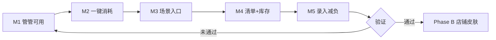

# Phase A 产品方向（现行）

> **状态**：已确认（2026-07-03），所有功能 PRD 默认读者为「家庭用户」。  
> 完整愿景见 [vision.md](vision.md)；交付状态见 [roadmap.md](roadmap.md)。

---

## 决策结论

| 项目 | 选择 |
|------|------|
| **Phase A 主攻** | 家庭物品管理 |
| **Phase B 扩展** | 小店铺 / 轻量库存（`space_type=shop` 皮肤） |
| **原则** | 一套内核，不换 App；先让家庭用户**每天用得上** |

**不采用**：家庭与小店两条线并行、两套 UI、两套数据模型。

---

## 北极星

> 用户能在 **10 秒内** 回答：家里某样东西 **在哪、还剩多少、要不要处理**。

---

## Phase A 范围

### In Scope

| # | 能力 | 状态 | 说明 |
|---|------|------|------|
| A1 | **问管管** | ✅ 已完成 | 查询 + NL 入库预填 + hello 动效 + 管管 P0/P1 |
| A2 | **一键消耗** | ✅ 已完成 | 物品详情「用了 1」 |
| A3 | **场景入口** | ✅ 已完成 | 首页空间 Chip / 厨房聚合 |
| A4 | **清单带库存** | ✅ 已完成 | 购物清单旁显示「现有 x」 |
| A5 | **临期/低库存闭环** | ✅ 基本完成 | 提醒 → 处理 → 可选加清单 |
| A6 | **录入减负** | ✅ 已完成 | 扫码 + 向导；NL 预填（规则优先） |

### Out of Scope（Phase B 及以后）

- 售价 / 日销 / 毛利报表
- CSV 批量导入导出
- `space_type=shop` onboarding
- 供应商 / 采购分单
- 完整 ERP / 收银对接

---

## 里程碑

| 里程碑 | 交付 | 验收 | 状态 |
|--------|------|------|------|
| M1 | 管管查询 + 首页入口 + hello 序列帧 | 5 类问题有结果 | ✅ |
| M2 | 物品详情「用了 1」 | 3 秒内完成消耗 | ✅ |
| M3 | 首页空间 Chip / 厨房聚合 | 少点 2 次进列表 | ✅ |
| M4 | 购物清单显示现有量 | 采购前不重复买 | ✅ |
| M5 | 规则 NL 预填入库 | 一句话进向导 | ✅ |

---

## Phase A Gate

> **走查清单**：[phase-a-gate.md](phase-a-gate.md)（2026-07-04 定稿）  
> **状态**：🟢 **研发自测通过**（2026-07-06）— 正式通过待 2 周 P0 观察

---

## Phase B 启动条件

满足 **任一** 再开店铺线：

- 家庭空间 ≥10 个真实物品的活跃用户占比达标（如 30%）
- 小店主误用家庭版且愿付费的明确需求
- M1～M5 走查通过且 **2 周无 P0 bug**（详见 [phase-a-gate.md](phase-a-gate.md)）

---

## 研发约定

> 代码里避免写死「家庭」字样时用 `space` / `tenant`；小店仅预留扩展点，不实现店铺 UI。

场景全景（家庭 + 小店对照）见归档：[`lwh/archive/code_changed/20260703_scenario_map_family_and_shop.md`](../../lwh/archive/code_changed/20260703_scenario_map_family_and_shop.md)。

---

## Phase B（MVP 暂定通过）

> **PRD**：[phase-b-shop-skin-prd.md](phase-b-shop-skin-prd.md)  
> **里程碑**：[phase-b-milestones.md](phase-b-milestones.md)  
> **Gate**：[phase-b-gate.md](phase-b-gate.md)  
> **状态**：🟢 **Gate 暂定通过**（2026-07-06 研发自测）— 可进入 B+ 评估

| 里程碑 | 内容 |
|--------|------|
| B1 | `space_type` + 注册/onboarding 分叉 | ✅ |
| B2 | 文案皮肤层（卖出/采购/断货） | ✅ |
| B3 | 店铺默认分类/位置 seed | ✅ |
| B4 | 管管店铺词表 + 危机优先级 | ✅ |
| Gate | 小店北极星三问走查 | 🟢 暂定通过 |

### Phase B 下一步（B+）

| 优先级 | 能力 | 说明 |
|--------|------|------|
| 1 | `sale_price` 售价字段 | ✅ 详情/表单/导出 |
| 2 | 简易日销 | ✅ 近7日卖出 + 营业额 |
| 3 | CSV 批量进货 | ✅ 模板 + bulk API 导入 |
| 4 | 供应商 `supplier` | ✅ 表单/详情/CSV/导出 |
| 5 | 毛利报表 | ✅ 日销扩展 cost/grossProfit |
| 6 | 批量导入 API | ✅ `POST /items/bulk` |
| 7 | CSV 库存导出 | ✅ 与进货模板对齐 |
| 8 | 统计页毛利图 | ✅ KPI + 双柱图 |
| — | 店员角色 Epic | ✅ E1～E3 已编码 — 见 [phase-b-staff-role-prd.md](phase-b-staff-role-prd.md) |
| — | B+ Gate | 🟢 研发自测通过 — 见 [phase-b-plus-gate.md](phase-b-plus-gate.md) |
| — | 店主试用包 | ✅ seed + 走查脚本 — 见 [phase-b-plus-trial-walkthrough.md](phase-b-plus-trial-walkthrough.md) |
| — | 正式 Gate | ≥3 店主外测 + 2 周无 P0 |

> B+ 核心能力与店员角色已编码；**下一步：执行店主外测，并行观察 2 周 P0**。

---

## Phase C（外测后立项）

> 在 B+ 正式 Gate 通过或外测反馈明确后再排期开发。

| 优先级 | Epic | 说明 | 触发条件 |
|--------|------|------|----------|
| 1 | **外测闭环** | ≥3 店主走查 + 反馈表 | 当前主线 |
| 2 | E3 盘点增强 | 已有 `/profile/inventory` 骨架，可按反馈加深 | 外测提到「对账/盘点」 |
| 3 | E4 OCR 录入 | 小票/价签拍照填表 | 外测提到「录入太累」 |
| 4 | 增量 sync 客户端 | 服务端 API 已有 | 多端不一致成为 P0 |
| 5 | 管管 P2 周报 Insight | 见 guanguan-butler-panel-prd | Phase A Gate 正式通过后 |
