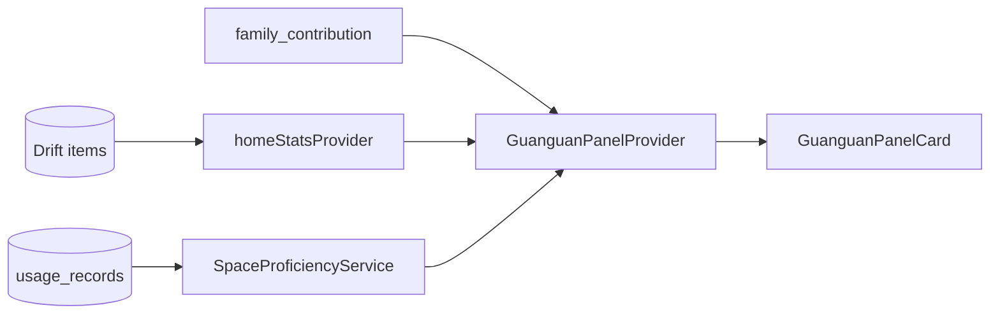

# 管管管家面板 PRD

> **状态**：P2 已落地（2026-07-04）；P0/P1 已完成  
> **灵感来源**：《菜鸟炊事兵》「底层岗位 + 可视成长系统 + 单元危机闭环」叙事公式  
> **依赖里程碑**：M4（清单带库存）完成后启动面板 MVP；P0 话术与「每日一危机」已先行落地  
> **关联文档**：[`current-phase.md`](current-phase.md)、[`doc/core/modules/assistant-guanguan.md`](../core/modules/assistant-guanguan.md)

---

## 一、背景与问题

| 现状 | 痛点 |
|------|------|
| 管管 Phase 1 仅规则查询 | 回复偏工具风，缺少「烟火日常」温度 |
| 首页 `TodaySummaryBanner` 堆数字 | 用户不知**先处理哪一件**，回访动力弱 |
| 提醒处理完仅系统 SnackBar | 缺少「小危机化解」的正向反馈闭环 |
| 个人中心已有健康分/贡献排行 | 数据有了，但未收敛为**单一可视面板** |

**目标**：把「管库存」讲成「管烟火」——喜剧外壳（管管吐槽）+ 温情内核（少浪费、少焦虑）。

---

## 二、产品定位

**管管管家面板** = 只有用户能看到的「家庭库存即时反馈层」，由管管担任 narrator。

- **不是**全息 RPG 大 UI、技能树、抽卡
- **是**今日任务、空间熟练度、协作态一句话、处理结算

与北极星对齐：用户在 **10 秒内**知道「要不要处理」；面板负责把「处理完」变成**可见的小胜利**。

---

## 三、用户故事

| 角色 | 故事 | 验收 |
|------|------|------|
| 忙碌家长 | 打开 App 第一眼看到「今天先处理牛奶」而非 5 条红字 | 首页 Banner 单主危机 |
| 录入懒人 | 问管管「厨房有什么」，得到带性格的回复 | 话术库覆盖 6 类意图 |
| 处理完提醒 | 点「用了 1」后管管庆祝一句 | SnackBar 带管管语气 |
| 家庭协作者 | 看到「妈妈录入多、爸爸消耗多」 | M4+ 面板协作态 |

---

## 四、功能范围

### 4.1 P0（已落地 / 本次交付）

| # | 能力 | 说明 |
|---|------|------|
| P0-1 | **管管话术库** | `guanguan_copy.dart` 集中管理，Executor 引用 |
| P0-2 | **每日一危机 Banner** | `TodaySummaryBanner` 单主危机标题 + 次要统计 |
| P0-3 | **处理闭环微反馈** | 消耗/丢弃/加清单 → `GuanguanCelebrationSnackBar` |
| P0-4 | **会话欢迎语** | 统一为「你好，我是管管…」 |

### 4.2 P1（M4 完成后）

| # | 能力 | 说明 |
|---|------|------|
| P1-1 | **管管今日面板** | 首页可折叠卡：任务 3 条封顶 |
| P1-2 | **空间熟练度** | 厨房 7 日录入+消耗 → Lv 展示 |
| P1-3 | **每日结算卡** | 主危机处理完 → 「今日厨房危机已化解」 |
| P1-4 | **成员协作态一句话** | 基于贡献 API + 规则文案 |

### 4.3 P2（留存验证后）

| # | 能力 | 状态 |
|---|------|------|
| P2-1 | 周报「单元剧复盘」Insight 卡（`backpack_open` 动效） | ✅ 2026-07-04 |
| P2-2 | 健康分连续 7 天绿 → 「本周零浪费」成就 | ✅ |
| P2-3 | Phase B 店铺皮肤：后厨档口文案 | 🟢 立项见 phase-b-shop-skin-prd |

### 4.4 Out of Scope

- 全息游戏 UI、全屏幻境特效
- 复杂技能树 / 抽卡奖励
- 写操作 NL 入库（属 M5，非本 PRD）

---

## 五、管管管家面板设计（P1 目标态）

### 5.1 信息架构

```
首页
├── 每日一危机 Banner（P0）──────► 提醒中心 / 物品详情
├── 管管今日面板（P1，可折叠）
│   ├── 今日任务 2/3
│   ├── 厨房熟练度 Lv.3
│   ├── 家庭协作一句话
│   └── 隐藏洞察（闲置物品）
├── 分区 Feed（现有）
└── 按空间（现有）
```

### 5.2 面板字段

| 字段 | 数据来源 | 更新频率 |
|------|----------|----------|
| 今日任务 | 临期/低库存/未录入 Top3 | 物品变更时 |
| 空间熟练度 | 7 日该空间录入+消耗次数 | 日切 |
| 协作态 | `family_contribution_provider` | 实时 |
| 隐藏洞察 | 30 天无消耗物品 | 日切 |

### 5.3 任务体系（贴合本职）

| 剧对照 | HomeStock 任务 |
|--------|----------------|
| 切菜涨熟练度 | 扫码录入 / 一键消耗 |
| 改良部队餐 | 临期物品三选一处理 |
| 安抚士兵味蕾 | 成员补货建议 |
| 化解食堂危机 | 每日主危机 |

### 5.4 奖励分层

| 层级 | 条件 | 奖励 |
|------|------|------|
| 基础 | 连续 7 天处理提醒 | 厨房快捷消耗布局解锁 |
| 进阶 | 健康分连续 7 天绿 | 管管周报「零浪费」 |
| 隐藏 | 全员贡献均衡 | 轻量「谁用了什么」时间线 |

---

## 六、每日一危机 — 用户流程（P0）

### 6.1 危机优先级

```
已过期 > 临期（7 天内）> 低库存
```

同类型取 `HomeStats` 中 `latest*Item` 代表物品。

### 6.2 流程图

```mermaid
flowchart TD
  open[用户打开首页] --> load[homeStatsProvider 加载统计]
  load --> check{有待处理?}
  check -->|否| hide[隐藏 Banner]
  check -->|是| resolve[DailyCrisisHelper 解析主危机]
  resolve --> banner[TodaySummaryBanner 展示单条主危机]
  banner --> tap{用户操作}
  tap -->|点 Banner 整体| alerts[/alerts 提醒中心]
  tap -->|点分类 Chip| tab[/alerts?tab=expiry|stock]
  tap -->|忽略| feed[继续浏览 Feed]
  alerts --> action{处理方式}
  action -->|用了 1| consume[recordQuickUsage]
  action -->|丢弃| discard[recordItemDiscard]
  action -->|加清单| shop[insertShoppingListItem]
  consume --> celebrate[GuanguanCelebrationSnackBar]
  discard --> celebrate
  shop --> celebrate
  celebrate --> refresh[itemEventBus 刷新 stats]
  refresh --> resolved{主危机消失?}
  resolved -->|是| clear[Banner 收起或显示全部搞定]
  resolved -->|否| next[展示下一个主危机]
```

### 6.3 文案结构

| 元素 | 示例 |
|------|------|
| 主标题 | 管管提醒：「牛奶」快过期了 |
| 副标题 | 还有 2 件待处理 · 先搞定这一件？ |
| 处理庆祝 | 干得漂亮！牛奶记上了，冰箱又清爽了一点 |
| 全部搞定 | 今天暂无待处理，管管给你点个赞 |

### 6.4 与现有组件关系

| 组件 | 角色 |
|------|------|
| `TodaySummaryBanner` | 每日一危机展示层（原 `TodayAlertBanner` 已废弃） |
| `HomeStats` | 统计真源，不新增 DB 表 |
| `DailyCrisisHelper` | 纯函数解析主危机 |
| `AlertCenterPage` | 危机处理主战场 |
| `QuickConsumeButton` | 详情页快速闭环 |

---

## 七、管管话术库规范

### 7.1 语气原则

- **亲切吐槽**，不攻击、不道德绑架
- **短句**，列表回复后有一句性格收尾
- **烟火感**：冰箱、厨房、囤货、快过期
- **不用**：ERP 术语、进销存、管理系统

### 7.2 意图覆盖

| 意图 | 性格化要点 |
|------|-----------|
| 空间查询 | 有物品时夸厨房热闹；空时轻松安慰 |
| 物品定位 | 找到时干脆报位置；找不到引导录入 |
| 临期 | 有则 urgency；无则「一切正常」松弛 |
| 低库存 | 补货暗示，不吓人 |
| 待处理 | 「建议先搞定」而非命令 |
| unknown | 困惑 + 建议 Chip |

### 7.3 代码约定

- 所有管管可见文案集中在 `core/assistant/guanguan_copy.dart`
- `AssistantExecutor` 禁止硬编码用户可见字符串
- 新增意图须同步话术库 + 单测

---

## 八、技术方案

### 8.1 新增文件

| 路径 | 职责 |
|------|------|
| `core/assistant/guanguan_copy.dart` | 话术库 |
| `core/assistant/daily_crisis_helper.dart` | 主危机解析 |
| `presentation/common/widgets/guanguan_celebration_snackbar.dart` | 处理庆祝反馈 |

### 8.2 修改文件

| 路径 | 变更 |
|------|------|
| `assistant_executor.dart` | 引用话术库 |
| `assistant_chat_page.dart` | 欢迎语、标题 |
| `today_summary_banner.dart` | 每日一危机 + 轻脉冲动效 |
| `quick_consume_button.dart` | 庆祝 SnackBar |
| `alert_center_page.dart` | 庆祝 SnackBar |

### 8.3 P1 面板数据流（预留）



---

## 九、里程碑与排期

| 阶段 | 内容 | 门禁 |
|------|------|------|
| **P0** | 话术库 + 每日一危机 + 庆祝反馈 | 无，本次交付 |
| **P1-A** | 可折叠面板 UI 壳 + 今日任务 | M4 ship |
| **P1-B** | 空间熟练度 + 协作态 | M4 + 贡献 API 稳定 |
| **P2** | 周报复盘 + 成就 | Phase A Gate 通过 |

---

## 十、验收标准

### P0 提测

| ID | 场景 | 预期 |
|----|------|------|
| T1 | 有 1 过期 + 2 临期 | Banner 主标题指向过期物品 |
| T2 | 仅低库存 | 主标题为低库存代表物品 |
| T3 | 问管管「什么快过期」 | 回复含管管语气 + 数据准确 |
| T4 | 提醒中心「用了 1」 | 庆祝 SnackBar，非纯系统文案 |
| T5 | 详情页一键消耗 | 同上 |
| T6 | 无待处理 | Banner 不显示 |
| T7 | 系统减少动态效果 | Banner 无脉冲动画 |

### P1 提测（后续）

| ID | 场景 | 预期 |
|----|------|------|
| T8 | 面板折叠/展开 | 状态本地记忆 |
| T9 | 完成 3 任务 | 任务进度 3/3 + 管管 happy |
| T10 | 厨房 7 日活跃 | 熟练度 Lv 正确 |

---

## 十一、风险与对策

| 风险 | 对策 |
|------|------|
| 游戏化过度伤害工具感 | 面板可折叠，默认收起；北极星操作路径不变 |
| 话术喧宾夺主 | 数据优先，性格一句收尾 |
| 主危机选错 | 优先级写死规则 + 单测覆盖 |
| 动画打扰 | 尊重 `disableAnimations` |

---

## 十二、索引

| 文档 | 路径 |
|------|------|
| 管管 IP 设计 | `lwh/code_changed/20260703_ai_mascot_character_design.md` |
| Phase A 方向 | `doc/product/current-phase.md` |
| 问管家模块 | `doc/core/modules/assistant-guanguan.md` |
| 本次落地记录 | `lwh/code_changed/20260704_guanguan_creative_adaptation.md` |
