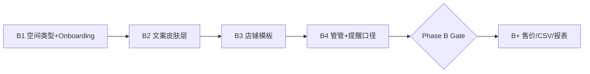

# Phase B 小店铺皮肤 PRD

> **状态**：MVP 交付 — Gate **暂定通过**（2026-07-06，见 [phase-b-gate.md](phase-b-gate.md)）  
> **前置**：Phase A M1～M5 + 管管 P0/P1/P2 已交付  
> **原则**：一套内核、不换 App；`space_type=shop` 为**皮肤 + 模板 + 话术**，非第二套 ERP  
> **关联**：[current-phase.md](current-phase.md) · [guanguan-butler-panel-prd.md](guanguan-butler-panel-prd.md) · [phase-b-milestones.md](phase-b-milestones.md)

---

## 一、立项背景

| 现状 | 机会 |
|------|------|
| 家庭线 Phase A 能力闭环 | 小店主已在用「家庭版」记进货/卖货 |
| 数据模型已有条码、进价、库存、记录、协作 | 缺 **店铺话术、默认模板、断货优先** |
| 管管 P2 周报/成就可复用 | 换「后厨档口」叙事即可 |

**小店主北极星（Phase B）**：

> 老板能在 **10 秒内** 回答：某 SKU **在哪架、还剩多少、要不要补货**。

与家庭北极星同构，仅 **「要不要处理」→「要不要补货」** 口径不同。

---

## 二、产品定位

**小店铺皮肤** = 在现有 HomeStock 上切换：

| 层 | 家庭（默认） | 店铺皮肤 |
|----|--------------|----------|
| 租户 | `Family` | 同一 `Family`，`space_type=shop` |
| 组织文案 | 我的家庭 | 我的店 |
| 入库 | 添加入库 | 进货 |
| 出库 | 用了 1 / 消耗 | 卖出 / 出库 |
| 清单 | 购物清单 | 采购清单 |
| 提醒优先 | 过期 > 临期 > 低库存 | **断货/低库存 > 临期** |
| 管管 | 厨房有什么 | 货架有什么 / 还剩几箱 |
| 空间默认 | 厨房、卫生间… | 店面、库房、柜台… |

**不做**：独立 App、完整 ERP、收银对接、毛利报表（Phase B+）。

---

## 三、启动条件（回顾）

满足 [current-phase.md](current-phase.md) / [phase-a-gate.md](phase-a-gate.md) **任一**：

- 家庭空间 ≥10 物品活跃用户占比 ≥30%
- 小店主误用家庭版且 **明确愿付费** ≥3 样本
- M1～M5 Gate 通过 + **2 周无 P0**

> 2026-07-04：产品侧 **先行立项** 文档与里程碑；研发排期待 Gate / 样本确认后启动 B1 编码。

---

## 四、Phase B MVP 范围

### 4.1 In Scope（B-MVP）

| # | 能力 | 说明 | 里程碑 |
|---|------|------|--------|
| B-1 | **`space_type` 字段** | `home` \| `shop`，Family 级，创建时选定 | B1 |
| B-2 | **Onboarding 分叉** | 注册/建空间：「家庭物品」/「小店铺库存」 | B1 |
| B-3 | **文案皮肤层** | 全局 Label 走 `SpaceSkinConfig`，禁止 UI 硬编码「家庭」 | B2 |
| B-4 | **店铺默认模板** | 分类（烟酒百货…）+ 位置树（店面/A架…）seed | B3 |
| B-5 | **管管店铺词表** | 进货/卖出/断货/货架查询；Parser 扩展 | B4 |
| B-6 | **提醒口径切换** | 店铺：低库存 Banner 优先于临期（可配置） | B4 |
| B-7 | **管管面板/周报皮肤** | 任务文案「后厨档口」；P2 Insight 换词 | B2 |
| B-8 | **一键出库文案** | 详情页「用了 1」→「卖出 1」（行为不变） | B2 |

### 4.2 Out of Scope（B-MVP 不做）

| 能力 | 阶段 |
|------|------|
| 售价 `sale_price`、日销/毛利报表 | B+ |
| CSV 批量导入导出 | B+ |
| 供应商字段、采购分单 | B+ |
| 店员细粒度权限（仅老板/店员角色预留） | B+ |
| POS / 收银对接 | 远期 |
| 独立店铺 App / 双 UI 栈 | ❌ 永不 |

---

## 五、用户故事（B-MVP）

| 角色 | 故事 | 验收 |
|------|------|------|
| 便利店老板 | 注册时选「小店铺」，默认分类是烟酒百货 | B1+B3 |
| 老板 | 扫码连续进货，详情点「卖出 1」减库存 | B2+B8 |
| 老板 | 问管管「红牛还剩多少」，得到货架+数量 | B4 |
| 老板 | 首页危机 Banner 优先提示断货 SKU | B4 |
| 老板 | 采购清单旁显示「现有 x」，避免重复进货 | 复用 M4 |
| 老板 | 管管周报写「本周卖出 N 次、进货 M 次」 | B2 |

---

## 六、信息架构（皮肤层）

```mermaid
flowchart TB
  subgraph tenant [Family 租户]
    ST[space_type home|shop]
    ST --> Skin[SpaceSkinConfig]
  end

  Skin --> UI[全局 Label / 图标文案]
  Skin --> GG[GuanguanCopy 委托]
  Skin --> Alert[提醒优先级策略]
  Skin --> Seed[分类/位置 seedData]

  UI --> Pages[首页 / 详情 / 清单 / 提醒]
  GG --> Assistant[问管管 Parser+Executor]
```

### 6.1 `SpaceSkinConfig` 字段（客户端真源草案）

| 键 | home 示例 | shop 示例 |
|----|-----------|-----------|
| `orgLabel` | 家庭 | 店铺 |
| `addItemLabel` | 添加入库 | 进货 |
| `consumeLabel` | 用了 1 | 卖出 1 |
| `shoppingListLabel` | 购物清单 | 采购清单 |
| `crisisLowStockHeadline` | 快见底了 | 快断货了 |
| `defaultSpaceName` | 厨房 | 店面 |
| `assistantSuggestions` | 厨房有什么 | 货架有什么 |

实现路径：`HomeWareClient/lib/core/config/space_skin_config.dart`（B2 交付）。

---

## 七、技术方案摘要

### 7.1 服务端

| 项 | 方案 |
|----|------|
| 模型 | `families.space_type` VARCHAR，`home` 默认，Alembic 迁移 |
| API | `POST /families`  body 增 `space_type`；`GET /families/current` 返回 |
| 兼容 | 旧数据全部 `home`；客户端未识别时 fallback home |
| 模板 | 店铺 seed 可服务端脚本或客户端 `seedData(shop)` 分支 |

### 7.2 客户端

| 项 | 方案 |
|----|------|
| 读取 | `authProvider` / `currentFamily.spaceType` → `spaceSkinProvider` |
| 替换 | 顶栏、Tab、按钮、SnackBar 走 skin；**不 fork 页面** |
| 管管 | `AssistantParser` 增店铺 utterance；`GuanguanCopy` 按 skin 分支 |
| 危机 | `DailyCrisisHelper` 增 `SpaceCrisisPriority` 策略 |
| 测试 | `space_skin_config_test` + parser 店铺用例 |

### 7.3 管管店铺意图（B4）

| 意图 | 示例 | 实现 |
|------|------|------|
| 货架有什么 | 店面有什么 / A架有什么 | 复用 `querySpaceItems` |
| 还剩多少 | 红牛还剩多少 | 复用 `queryItemLocation` |
| 断货 | 什么快断货 / 库存不足 | 复用 `queryLowStock` |
| 要补什么 | 今天要补什么 | 复用 `queryPending` |
| 进货 NL | 进了10箱可乐 | 复用 M5 `addItem` parser |

---

## 八、里程碑与排期

详见 [phase-b-milestones.md](phase-b-milestones.md)。



| 里程碑 | 预估 | 交付物 |
|--------|------|--------|
| B1 | 1 周 | DB 字段 + 注册分叉 + API |
| B2 | 1 周 | `SpaceSkinConfig` + 主要页面换肤 |
| B3 | 0.5 周 | 店铺 seed 分类/位置 |
| B4 | 1 周 | 管管词表 + 危机优先级 |
| **B-MVP Gate** | — | 小店主 10 秒三问走查 |

**总估**：3～4 周（1 人全栈），可与 Gate 观察期并行 B1 设计评审。

---

## 九、Phase B Gate（预览）

| ID | 场景 | 标准 |
|----|------|------|
| SB-1 | 在哪 | 问管管「红牛在哪」≤10s |
| SB-2 | 剩多少 | 详情 / 采购清单「现有 x」≤10s |
| SB-3 | 要不要补 | 断货 Banner / 管管任务 ≤10s |
| SB-4 | 皮肤一致 | 无「家庭/厨房」漏网硬编码 |
| SB-5 | 家庭回归 | `space_type=home` 行为与 Phase A 一致 |

---

## 十、风险

| 风险 | 缓解 |
|------|------|
| 皮肤漏改导致文案混用 | grep CI + 皮肤单测 + Gate SB-4 |
| 店铺需求膨胀为 ERP | PRD Out of Scope 锁 B+ |
| 无真实店主验证 | Gate 前至少 3 人走查 |
| `space_type` 中途变更 | B-MVP 不支持切换，仅新建时选 |

---

## 十一、文档索引

| 文档 | 用途 |
|------|------|
| [phase-b-milestones.md](phase-b-milestones.md) | B1～B4 任务拆解 |
| [lwh/archive/.../20260703_scenario_map_family_and_shop.md](../../lwh/archive/code_changed/20260703_scenario_map_family_and_shop.md) | 双 persona 场景 |
| [guanguan-butler-panel-prd.md](guanguan-butler-panel-prd.md) | 管管 P2-3 后厨档口 |

---

## 十二、签核

| 角色 | 日期 | 结论 |
|------|------|------|
| 产品 | 2026-07-04 | 立项通过，待 Gate/样本后开 B1 编码 |
| 研发 | | |
| 设计 | | |
