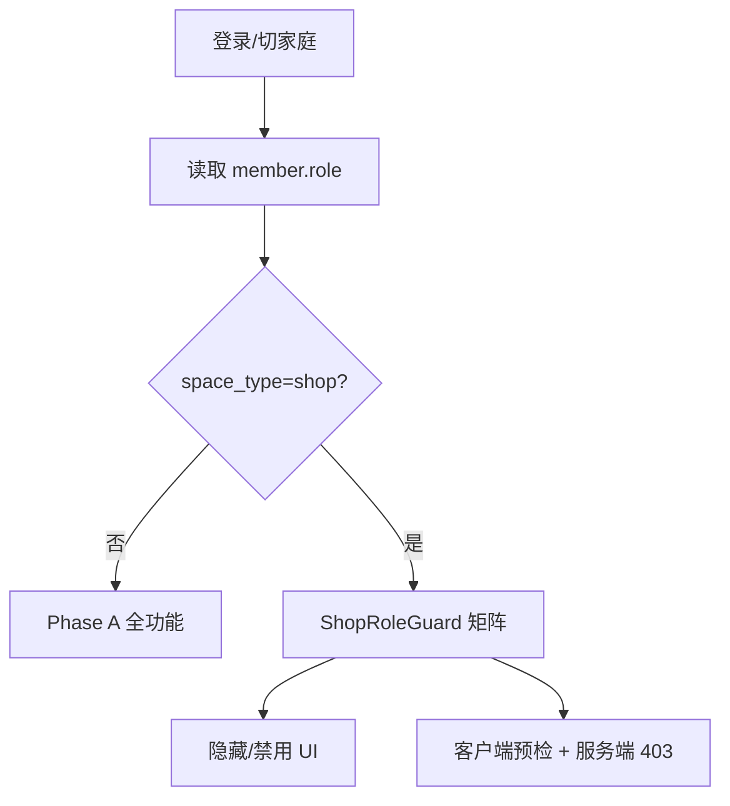

# Phase B+ 店员角色 Epic PRD

> **状态**：✅ E1～E3 已编码（2026-07-06）  
> **前置**：B+ 核心已编码（售价/日销/CSV/供应商/毛利/bulk API）  
> **原则**：复用现有 `family_members.role`，不新建权限子系统；**仅 `space_type=shop` 启用店员语义**  
> **关联**：[phase-b-shop-skin-prd.md](phase-b-shop-skin-prd.md) · [phase-b-milestones.md](phase-b-milestones.md) · [current-phase.md](current-phase.md)

---

## 一、摘要

小店铺常见 **老板 + 1～2 名店员** 协作：店员负责日常卖出、扫码进货；老板管价格、采购、成员与设置。当前系统仅有 `owner / admin / member` 三档，**无法区分「只能卖货」与「能改价删库」**。

本 Epic 在 **不引入第二套 RBAC** 的前提下，为 shop 空间增加 **店员角色映射 + 能力矩阵 + UI/API 守卫**，满足外测中「多人看店」诉求。

**北极星补充（协作维）**：

> 老板能在 **30 秒内** 邀请店员，店员 **当天即可** 完成「卖出 / 进货」且 **看不到** 家庭设置与敏感操作。

---

## 二、背景与机会

| 现状 | 缺口 |
|------|------|
| `FamilyMember.role` 已有 owner/admin/member | shop 场景缺少「店员」产品语义 |
| API 有 `require_member / require_admin / require_owner` | 未按「录入/只读」细分 |
| 客户端无基于角色的 UI 隐藏 | 店员可进设置、改价、删家庭 |
| 场景 map 标注「店员权限」为店铺加强项 | B+ backlog 唯一未编码项 |

**不做**：按功能点的完整 ACL 引擎、跨店多租户、收银 POS 权限。

---

## 三、目标与非目标

### 3.1 目标（MVP）

| # | 目标 | 度量 |
|---|------|------|
| G1 | shop 空间可邀请并标记 **店员** | 老板 3 步内完成邀请 |
| G2 | 店员可 **卖出、进货、查库存、问管管** | 走查 5 项全通过 |
| G3 | 店员 **不可** 改售价/进价、删物品、管成员、删店 | 越权 API 返回 403 |
| G4 | home 空间 **行为不变** | SB-5 回归通过 |

### 3.2 非目标（本 Epic 不做）

- 按货架/分类的数据范围隔离（店员只看 A 架）
- 操作审批流（卖出需老板确认）
- 独立店员 App / 账号体系
- 收银机/POS 工号登录

---

## 四、角色定义

### 4.1 角色映射（shop 空间）

沿用 DB 字段 `family_members.role`，**新增枚举值 `clerk`**（店员）；home 空间继续仅 owner/admin/member。

| 产品角色 | DB `role` | 典型用户 | 说明 |
|----------|-----------|----------|------|
| 老板 | `owner` | 店主 | 全部能力 + 转让/删店 |
| 店长 | `admin` | 合伙人 | 与老板接近，不可删店/转让（保持现状） |
| **店员** | **`clerk`** | 收银/理货 | **新增** — 日常录入与查询 |
| 只读 | `viewer` | 财务/合伙人 | **新增（可选 MVP）** — 仅查看 |
| 成员 | `member` | — | home 默认；shop 邀请时 **不再作为默认** |

> **MVP 建议**：首版只做 `clerk`；`viewer` 可 Phase B++ 再开。

### 4.2 权限矩阵（shop）

| 能力 | owner | admin | clerk | viewer |
|------|:-----:|:-----:|:-----:|:------:|
| 查看物品/位置/库存 | ✅ | ✅ | ✅ | ✅ |
| 卖出 / 记 usage | ✅ | ✅ | ✅ | ❌ |
| 进货 / 新建物品 | ✅ | ✅ | ✅ | ❌ |
| 扫码入库 | ✅ | ✅ | ✅ | ❌ |
| CSV 批量进货 | ✅ | ✅ | ❌ | ❌ |
| 改售价/进价/供应商 | ✅ | ✅ | ❌ | ❌ |
| 删除物品 | ✅ | ✅ | ❌ | ❌ |
| 导出 CSV | ✅ | ✅ | ✅ | ✅ |
| 采购清单增删 | ✅ | ✅ | ✅ | ❌ |
| 提醒中心处理 | ✅ | ✅ | ✅ | ❌ |
| 问管管 | ✅ | ✅ | ✅ | ✅ |
| 数据统计（含毛利） | ✅ | ✅ | ✅ | ✅ |
| 邀请/移除成员 | ✅ | ✅ | ❌ | ❌ |
| 改成员角色 | ✅ | ❌ | ❌ | ❌ |
| 家庭/店铺设置 | ✅ | ✅ | ❌ | ❌ |
| 删店 / 转让 | ✅ | ❌ | ❌ | ❌ |

**home 空间**：忽略 `clerk/viewer`，`member` 保持现有「全家可改」策略（Phase A 行为）。

---

## 五、用户故事

| ID | 角色 | 故事 | 验收 |
|----|------|------|------|
| US-1 | 老板 | 邀请员工为「店员」，对方登录后看到「卖出/进货」但无设置入口 | 邀请流 + UI 隐藏 |
| US-2 | 店员 | 扫条码进货 3 件，详情点「卖出 1」 | 库存正确，usage 有 operator |
| US-3 | 店员 | 尝试改售价 | 表单字段只读或不可见，PUT 403 |
| US-4 | 店员 | 尝试 CSV 批量导入 | 入口不可见，POST bulk 403 |
| US-5 | 老板 | 将店员升为 admin | 角色变更后可见 CSV 导入 |
| US-6 | home 用户 | 家庭成员仍为 member | 无 clerk 选项，无回归 |

---

## 六、方案设计

### 6.1 服务端

| # | 任务 | 说明 |
|---|------|------|
| S1 | Alembic 无需改表 | `role` 已是 String(20) |
| S2 | 扩展 `require_*` | 新增 `require_clerk_or_above`（owner/admin/clerk 可写库存） |
| S3 | 路由守卫 | 见下表 |
| S4 | 邀请 API | `POST /families/invite` 支持 `role=clerk`（shop 校验） |
| S5 | 改角色 API | 仅 owner 可设 clerk/admin；admin 不可升降 owner |
| S6 | usage 记录 | 写入 `operator_id` / `operator_name`（已有字段） |

**API 守卫（写操作）**

| 端点 | 最低角色 |
|------|----------|
| `POST /items`, `POST /items/bulk` | clerk+；bulk 需 admin+ |
| `PUT /items/{id}` 改价格字段 | admin+ |
| `DELETE /items/{id}` | admin+ |
| `POST /items/{id}/use` | clerk+ |
| `GET /items`, `GET export/*` | member+（含 viewer） |
| `PUT /families/*`, 成员管理 | admin+ |
| 删店 / 转让 | owner |

实现方式：在 `ItemService` / 路由层增加 `_assert_shop_role(min_role)`，**home 空间跳过**（保持 require_member 即可）。

### 6.2 客户端

| # | 任务 | 文件/位置 |
|---|------|-----------|
| C1 | `FamilyMember.role` 解析 clerk | family_service / providers |
| C2 | `ShopRoleGuard` | `core/auth/shop_role_guard.dart` |
| C3 | UI 隐藏 | 设置、CSV 导入、改价字段、删物品按钮 |
| C4 | 成员管理页 | shop 显示「店员」选项 |
| C5 | 403 友好提示 | 「需要老板权限」SnackBar |
| C6 | 本地缓存 role | 登录/切家庭时刷新 |

### 6.3 数据与兼容

- 旧 shop 成员 role=member → **迁移脚本或首次登录提示** 老板确认是否改为 clerk
- 默认策略：shop 新邀请默认 `clerk`；home 新邀请仍 `member`

---

## 七、验收标准（Epic Gate）

| # | 项 | 标准 |
|---|-----|------|
| AC-1 | 邀请店员 | 老板邀请 → 店员账号可见物品列表 |
| AC-2 | 店员卖出 | 3 秒内完成「卖出 1」 |
| AC-3 | 越权改价 | UI 不可编辑 + API 403 |
| AC-4 | 越权 bulk | POST `/items/bulk` 403 |
| AC-5 | home 回归 | Phase A Gate 用例无 diff |
| AC-6 | 审计 | usage 记录含 operator_name |

---

## 八、里程碑建议

| 阶段 | 交付 | 工期（估） |
|------|------|-----------|
| **E1** | 服务端 role 枚举 + API 守卫 | 2～3 天 |
| **E2** | 客户端 ShopRoleGuard + UI 隐藏 | 2～3 天 |
| **E3** | 成员邀请/改角色 UI | 1～2 天 |
| **E4** | 单测 + 2 人协作走查 | 1 天 |

**建议顺序**：外测包（CSV 导出/毛利图）→ 正式 Gate 样本 → 有「多人看店」反馈再开 E1。

---

## 九、风险与对策

| 风险 | 对策 |
|------|------|
| 角色膨胀 | 仅 clerk + 复用 owner/admin，viewer 延后 |
| home/shop 守卫分叉 | `space_type` 判断集中在一处 Guard |
| 客户端仅藏 UI 不安全 | **服务端 403 为真源** |
| member 历史数据 | 提供 owner 批量「设为店员」入口 |

---

## 十、Go / No-Go

| 维度 | 阈值 |
|------|------|
| 外测反馈 | ≥2 位店主提到「员工也要用」 |
| 技术债 | B+ 正式 Gate 无 P0 |
| 资源 | 1 后端 + 1 客户端 ≤1 周 |

**Go**：满足上表 → 按 E1～E4 立项。  
**No-Go**：外测均为单人店 → 延后，优先 Phase A Gate 与 home 增长。

---

## 十一、相关变更索引

| 文档 | 说明 |
|------|------|
| [phase-b-milestones.md](phase-b-milestones.md) §B+ backlog | 店员角色来源 |
| [lwh/archive/code_changed/20260703_scenario_map_family_and_shop.md](../../lwh/archive/code_changed/20260703_scenario_map_family_and_shop.md) | 协作场景 |
| `HomeWareServer/app/core/dependencies.py` | 现有 require_* |
| `HomeWareServer/app/models/family.py` | FamilyMember.role |
