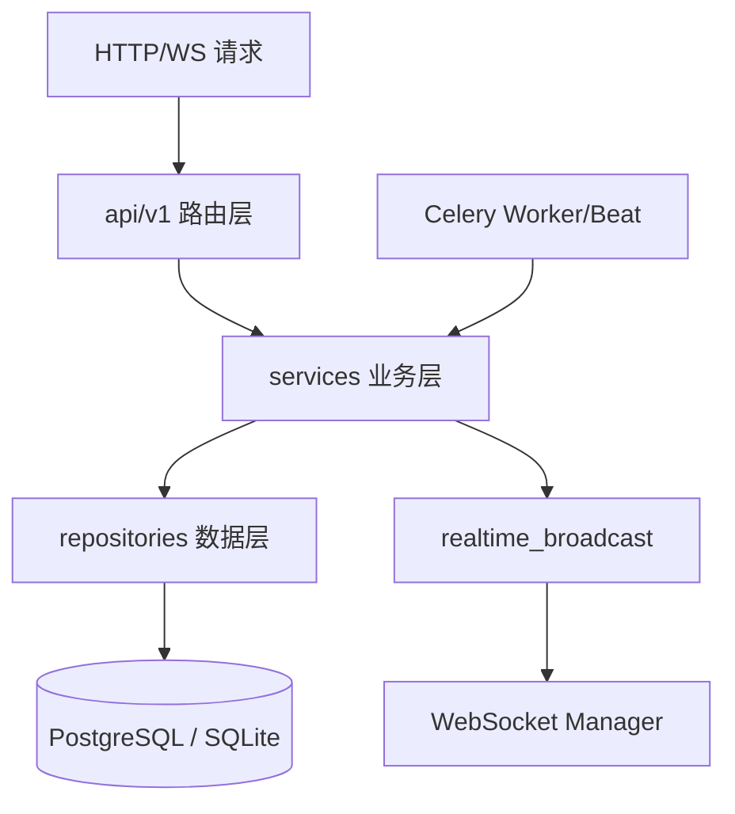
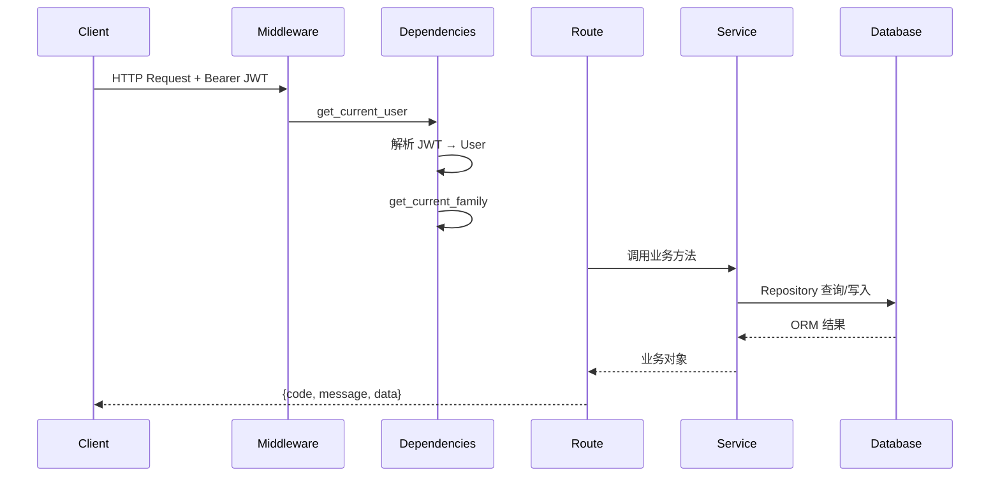
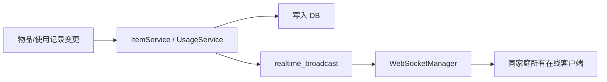

# FastAPI 服务端架构

> 对应目录：`HomeWareServer/`。默认端口 **8000**，API 前缀 **`/api/v1`**。  
> 核心流程图见 [core/business-flows.md](../core/business-flows.md)。

---

## 一、技术栈

| 类别 | 选型 |
|------|------|
| 框架 | FastAPI + uvicorn |
| ORM | SQLAlchemy 2.0（async） |
| 数据库 | PostgreSQL（生产）/ SQLite（开发） |
| 认证 | JWT（python-jose）+ pbkdf2_sha256 |
| 任务队列 | Celery + Redis |
| 迁移 | Alembic |
| 限流 | slowapi（可选） |

---

## 二、三层架构



**原则**：Route → Service → Repository。不在 Route 写业务逻辑，不在 Service 写原始 SQL。

```
app/
├── api/v1/          # 路由层 — 薄，参数校验，调用 Service
├── services/        # 业务逻辑
├── repositories/    # SQLAlchemy 查询
├── models/          # ORM 模型
├── schemas/         # Pydantic 请求/响应
├── tasks/           # Celery 定时任务
└── core/            # database、security、deps、middleware、config
```

---

## 三、请求处理流程



### 依赖注入（`core/dependencies.py`）

| 依赖 | 作用 |
|------|------|
| `get_current_user` | 解析 JWT Bearer |
| `get_current_family` | 当前选中家庭 |
| `require_member` / `require_admin` / `require_owner` | 角色级联校验 |

---

## 四、统一响应格式

```json
{
  "code": 200,
  "message": "success",
  "data": { }
}
```

错误时 `code` 为非 200，`message` 为可读说明。

---

## 五、主要模块

| 模块 | 路由前缀 | 职责 |
|------|----------|------|
| auth | `/auth` | 注册、登录、刷新、登出 |
| users | `/users` | 资料、密码、通知偏好 |
| families | `/families` | 家庭 CRUD、成员、切换 |
| items | `/items` | 物品 CRUD、use/finish/discard/move |
| categories | `/categories` | 分类树 |
| locations | `/locations` | 位置树 |
| usage_records | `/usage-records` | 使用记录（客户端主要走此接口） |
| shopping | `/shopping` | 购物清单 |
| alerts | `/alerts` | 提醒列表与摘要 |
| statistics | `/statistics` | 消费与浪费统计 |
| upload | `/upload` | 图片上传/删除 |
| sync | `/sync` | 增量同步（客户端暂未接） |
| activities | `/activities` | 家庭动态 |
| notifications | `/notifications` | 站内通知 |
| export | `/export` | CSV/JSON 导出 |
| barcode | `/barcode` | 条码查询 |
| ws | `/ws` | WebSocket 实时推送 |
| health | `/health` | 健康检查 |

完整端点列表见 [api-reference.md](api-reference.md)。交互式文档：`/docs`。

---

## 六、WebSocket 广播



| 事件 | 触发场景 |
|------|----------|
| `items_changed` | 物品 CRUD |
| `usage_changed` | 创建使用记录 |
| `alerts_changed` | 提醒状态变更 |
| `ping` | 心跳（客户端回 pong） |

连接：`ws(s)://host/api/v1/ws/notifications?token=JWT`，需 `current_family_id`。

---

## 七、异步任务

Celery Worker / Beat（`app/tasks/`）：

- 过期扫描、库存提醒
- 推送通知（配合 `devices`、`notifications`）

开发模式可不启 Redis，任务相关功能降级。

---

## 八、配置与启动

- 开发：`ENV_FILE=.env.dev` 或 `.env`（SQLite，无需 Redis）
- 生产：`DATABASE_URL`、`REDIS_URL`、`JWT_SECRET_KEY`、`UPLOAD_DIR`
- 读取：`app/config.py`（pydantic-settings）

```bash
cd HomeWareServer
./start-dev.ps1          # Windows 开发
uvicorn app.main:app --host 0.0.0.0 --port 8000 --reload
```

---

## 九、与归档 Phase 文档的差异

| 归档描述 | 现行 |
|----------|------|
| 项目名 home_stock_server | 目录 HomeWareServer |
| bcrypt 密码 | pbkdf2_sha256 |
| Phase 任务清单 | 已实现，细节以代码与 OpenAPI 为准 |

历史任务书见 [`archive/server-phase-specs/`](../archive/server-phase-specs/)。
