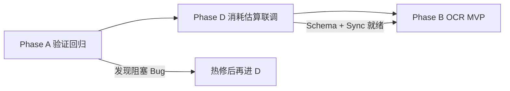
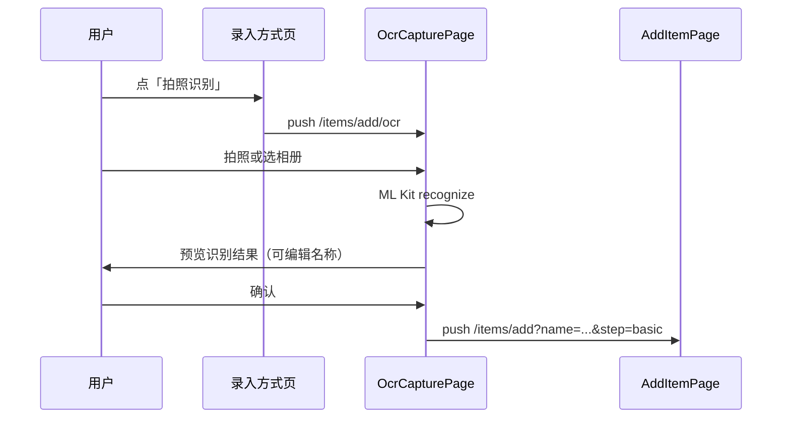

# Phase A → D → B 执行计划

**日期**：2026-07-02  
**策略**：先稳基础（验证）→ 再补数据闭环（消耗估算）→ 最后上新能力（OCR）  
**前置**：Phase I→L 已落地（WS 可观测性、盘点服务端同步、预计使用天数 UI）

**关联文档**：
- [`20260702_e2_websocket_verification.md`](20260702_e2_websocket_verification.md)
- [`20260702_phase_i_l_execution.md`](20260702_phase_i_l_execution.md)

---

## 总览



| 阶段 | 目标 | 预估工时 | 产出 |
|------|------|----------|------|
| **A** | 确认 E2 / 盘点 / 消耗 UI 在真实环境可用 | 0.5～1 天（人工） | 签字版验证记录 |
| **D** | 消耗估算全链路：创建 → 持久化 → 同步 → 展示 | 1～2 天（开发） | 后端 Schema + 客户端 Sync 修复 |
| **B** | 拍照识别 MVP：选图 → 识别 → 预填向导 | 2～3 天（开发） | OCR 页 + 解析服务 |

**门禁**：A 全部 P0 用例通过后才启动 D；D 联调通过后才启动 B。

---

## Phase A — 验证回归（稳基础）

> **性质**：以人工验证为主，仅发现阻塞问题时做小范围热修。  
> **不负责**：新功能开发。

### A1. 环境与启动

| # | 检查项 | 操作 | 预期 |
|---|--------|------|------|
| A1-1 | 后端 | `.\start-dev.ps1` 或 Docker 启动 | `/api/v1` 可访问 |
| A1-2 | 客户端 | `.\scripts\run_dev.ps1` **热重启** | 非热重载 |
| A1-3 | API 地址 | 检查 `config/env.local.json` | 含 `/api/v1` 前缀 |
| A1-4 | 双端同家庭 | 两设备登录同一账号/家庭 | 家庭 ID 一致 |

### A2. E2 WebSocket（P0）

在 [`20260702_e2_websocket_verification.md`](20260702_e2_websocket_verification.md) 基础上扩展：

| # | 场景 | 预期 | 优先级 |
|---|------|------|--------|
| A2-1 | 登录后个人中心 | 显示「实时同步已连接」 | P0 |
| A2-2 | A 记消耗 → B 等待 ≤5s | B 首页/Badge/物品数量自动刷新 | P0 |
| A2-3 | 杀后端 → 恢复 | 客户端变为「重连中」→「已连接」 | P1 |
| A2-4 | A 登出 | 状态「未连接」，日志 `已断开` | P1 |
| A2-5 | A 断网记消耗 → 联网 | 离线记录补推，B 可见 | P1 |

**日志关键字**（客户端）：
- `[RealtimeSync] INFO: 连接`
- `[RealtimeSyncController] INFO: 开始防抖同步`
- `[RealtimeSyncController] INFO: 同步完成`

**日志关键字**（后端）：
- `WebSocket 广播 event=items_changed`

### A3. 盘点修正同步（P0）

| # | 场景 | 预期 |
|---|------|------|
| A3-1 | 设备 A 进入盘点 → 修正某物品数量 | 本地数量更新 |
| A3-2 | 日志 | `[InventoryTask] INFO: 服务端库存已同步` |
| A3-3 | 设备 B 刷新/WS 触发 | 数量与 A 一致 |
| A3-4 | 完成盘点 | 选空间页底部出现「最近盘点」记录 |

**失败排查**：
- `ItemIdResolver.toServerId` 为 null → 物品未同步过服务端，需先全量 sync
- API 401 → token 过期，重新登录

### A4. 消耗估算 UI（P1，为 D 做基线）

| # | 场景 | 预期 |
|---|------|------|
| A4-1 | 添加入库 Step4 填「预计使用天数」5 天 | 保存成功 |
| A4-2 | 物品详情「状态总览」 | 显示预测/用完相关文案 |
| A4-3 | **重启 App 后** | 预测字段是否仍在（当前可能仅本地，D 阶段修复） |

### A5. 自动化 smoke（P1）

```powershell
cd HomeWareClient
flutter test
flutter analyze
```

| 套件 | 文件 |
|------|------|
| 事件总线 / 搜索 | `item_event_bus_test.dart`, `search_utils_test.dart` |
| 盘点历史 | `inventory_task_storage_test.dart` |
| 消耗估算 | `item_form_consumption_test.dart` |
| WS 状态 | `realtime_sync_status_test.dart` |

### A6. 出口标准（进入 Phase D 的条件）

- [ ] A2-1、A2-2 通过
- [ ] A3-1～A3-3 通过
- [ ] 阻塞 Bug 已记录并修复（或无）
- [ ] 验证结果写入 [`20260702_phase_a_verification_result.md`](20260702_phase_a_verification_result.md)（执行 A 时填写）

---

## Phase D — 消耗估算后端对齐 + 同步（数据闭环）

> **背景**：客户端 Phase K 已写 `estimatedUseDays` → `avg_daily_consumption` / `predicted_empty_date`，但：
> 1. `CreateItemRequest` / `UpdateItemRequest` **未声明**这两字段 → FastAPI 丢弃入参  
> 2. `item_sync_service.dart` 列表同步时 **强制 `Value.absent()`** → 服务端预测被抹掉  
> 3. `prediction_service` 会按使用记录重算，需定义与用户手填的优先级

### D1. 后端 Schema（P0）

**文件**：`HomeWareServer/app/schemas/item.py`

| 字段 | 加入位置 | 类型 |
|------|----------|------|
| `avg_daily_consumption` | `CreateItemRequest`, `UpdateItemRequest` | `Optional[float]` |
| `predicted_empty_date` | 同上 | `Optional[date]` |

**可选增强**：`estimated_use_days: Optional[int]` — 若希望服务端统一计算，可只收天数由 service 算 avg/date。

### D2. 后端 Service 策略（P0）

**文件**：`HomeWareServer/app/services/item_service.py`

```
创建/更新时：
  IF 请求带 avg_daily_consumption + predicted_empty_date
    → 直接持久化（用户手填优先）
  ELIF 请求带 estimated_use_days
    → avg = current_quantity / days
    → predicted = today + days
  ELSE
    → 保持现有 prediction_service 逻辑（有 usage 后重算）
```

**重算冲突策略**（建议）：

| 场景 | 行为 |
|------|------|
| 新建且用户填了预计天数 | 用手填值，标记来源（可选字段 `prediction_source=user`） |
| 后续记消耗 ≥3 次 | 定时任务 / 记消耗后触发 `prediction_service` 覆盖 |
| 用户编辑并改预计天数 | 更新为新的手填值 |

**广播**：创建/更新带预测字段变更时，已有 `items_changed` 广播即可。

### D3. 客户端 Sync 修复（P0）

**文件**：`HomeWareClient/lib/core/services/item_sync_service.dart`

- 列表/详情 JSON 映射补上：
  - `avg_daily_consumption` → `avgDailyConsumption`
  - `predicted_empty_date` → `predictedEmptyDate`
- 删除第 177～178 行的强制 `Value.absent()`（改为按 JSON 解析）

**文件**：`HomeWareClient/lib/core/services/item_service.dart`（如有详情拉取）

- 确认 GET `/items/{id}` 响应字段写入 Drift

### D4. 客户端创建/更新（P1）

**文件**：`item_form_controller.dart`（已有 `buildCreateApiBody` 写入）

- 验证字段名与后端 snake_case 一致
- 编辑模式：`applyToExistingItem` 同步更新预测字段（若用户改了预计天数）

### D5. 测试（P0）

| 层 | 内容 |
|----|------|
| 后端 | 创建物品带 `avg_daily_consumption` → GET 返回一致 |
| 后端 | 更新 `predicted_empty_date` → 持久化 |
| 客户端 | `item_sync_service` 单元测试：JSON → Companion 字段映射 |
| 客户端 | 已有 `item_form_consumption_test.dart` 保持绿 |

### D6. 验收标准

| ID | 场景 | 预期 |
|----|------|------|
| D-T1 | 新建物品填预计 7 天 | 服务端 DB 有 avg/date |
| D-T2 | B 设备 sync 后 | 详情预测文案与 A 一致 |
| D-T3 | 记消耗 5 次后 | prediction_service 重算覆盖（若已实现触发） |
| D-T4 | 重启 App | 预测字段不丢失 |

### D7. 任务拆分（开发顺序）

1. Schema 补字段 → `item_service.create_item` / `update_item` 接收  
2. 修复 `item_sync_service` 映射  
3. 手动联调 A4 场景  
4. 补测试 + 更新 [`20260702_phase_i_l_execution.md`](20260702_phase_i_l_execution.md) 注意事项  

**预估**：后端 0.5 天 + 客户端 0.5 天 + 联调 0.5 天

---

## Phase B — OCR 拍照识别 MVP（Epic E4）

> **背景**：`add_item_method_page.dart` 中「拍照识别」为 disabled 占位。  
> **目标**：用户选/拍一张照片 → 识别文字 → 提取名称/品牌/条码 → 跳转 `/items/add` 预填 Step2。

### B0. 方案选型

> **产品约束（2026-07-02）**：零三方 API、零服务端 OCR，详见 [`20260702_ocr_local_only_decision.md`](20260702_ocr_local_only_decision.md)。

| 方案 | 优点 | 缺点 | 状态 |
|------|------|------|------|
| **B-1 客户端 ML Kit** | 离线、无后端改动、延迟低 | Android/iOS 为主；Windows/Web 需降级 | ⭐ **唯一实施路径** |
| ~~B-2 后端 OCR API~~ | — | 算力/运维成本 | ❌ 不做 |
| ~~B-3 云 OCR（Azure/百度）~~ | — | 按量费用、密钥管理 | ❌ 不做 |

**决策**：**仅 B-1 端侧 ML Kit（或后续本地小模型）+ 非 mobile 平台降级提示**

```
Android / iOS → google_mlkit_text_recognition
Windows / Web / 桌面 → SnackBar「当前平台请使用手动向导或扫码」
```

### B1. 依赖与权限

**pubspec.yaml**（Android/iOS）：
```yaml
google_mlkit_text_recognition: ^0.15.0  # 版本按 Flutter 兼容选取
```

已有：`image_picker: ^1.2.2`

**权限**：相机/相册（AndroidManifest、Info.plist — 若已有 image_picker 配置可复用）

### B2. 模块设计

```
lib/
  core/
    services/
      ocr_service.dart          # 统一入口：pickImage → recognize → OcrResult
    utils/
      ocr_text_parser.dart      # 从 raw text 提取 name / brand / barcode
  presentation/
    items/
      ocr_capture_page.dart     # 拍照/选图 + 识别进度 + 结果预览
```

**OcrResult 模型**：
```dart
class OcrResult {
  final String rawText;
  final String? suggestedName;
  final String? suggestedBrand;
  final String? suggestedBarcode;
  final double confidence; // 可选
}
```

**ocr_text_parser 规则（MVP 启发式）**：
1. 条码：匹配 `\d{8,14}` EAN/UPC
2. 品牌：含「品牌」「Brand」行或首行大写词
3. 名称：最长非空行 / 含「品名」「名称」行
4. 兜底：取 rawText 第一行作为名称

### B3. 路由与入口

| 项 | 值 |
|----|-----|
| 路由 | `/items/add/ocr` |
| 入口 | `AddItemMethodPage` 启用「拍照识别」卡片 |
| 成功跳转 | `/items/add?name=...&brand=...&barcode=...&step=basic` |
| 失败 | 仍跳转 add，仅带 `ocrRaw=...` 供用户手动选 |

**AddItemPage 扩展**（小改）：
- 新增 query：`brand`（已有 name/barcode/step）
- `initState` 预填 `ItemFormController`

### B4. UI 流程



**OcrCapturePage 要点**：
- 加载态：`CircularProgressIndicator` + 「正在识别…」
- 结果态：TextField 可改名称 + 「重新拍照」「确认填入」
- 日志：`[OcrService] INFO/WARN/ERROR`

### B5. 与现有能力衔接

| 能力 | 衔接 |
|------|------|
| 条码识别到数字 | 复用 `BarcodeService.lookup` 补品牌/品名 |
| 图片 | 可选：识别后把照片加入 `imagePaths`（二期） |
| 草稿 | 不写入 draft，确认后进向导 |

### B6. 后端

**永久不做**服务端 OCR 接口（含 `POST /api/v1/ocr/recognize`）。  
Web / Windows 若需 OCR，仅通过 **端侧本地引擎** 或 **提示用户使用扫码/手动向导**。

### B7. 测试

| 类型 | 内容 |
|------|------|
| 单元 | `ocr_text_parser_test.dart` — 固定样例文本 → name/brand/barcode |
| 单元 | `OcrResult` 空文本、仅条码、中英文混排 |
| 手动 | 实拍包装图 / 小票 / 模糊图 |

### B8. 验收标准

| ID | 场景 | 预期 |
|----|------|------|
| B-T1 | Android 拍商品正面 | 3s 内出结果，名称可编辑 |
| B-T2 | 确认识别 | 向导 Step2 名称/品牌已填 |
| B-T3 | 识别失败 | 友好提示，可转手动向导 |
| B-T4 | Windows 点击 | 提示平台不支持，不 crash |
| B-T5 | 录入方式页 | 「拍照识别」enabled，eta 改为「约 15 秒」 |

### B9. 任务拆分（开发顺序）

1. `ocr_text_parser.dart` + 单元测试（无设备依赖，先做）  
2. `ocr_service.dart` — image_picker + ML Kit 封装  
3. `ocr_capture_page.dart` + 路由  
4. `AddItemMethodPage` 启用入口 + `AddItemPage` query 预填  
5. 真机联调 + 文档 [`20260702_phase_b_ocr_impl.md`](20260702_phase_b_ocr_impl.md)  

**预估**：2～3 天（含 Android 真机调试）

---

## 风险与依赖

| 风险 | 影响 | 缓解 |
|------|------|------|
| WS 仍握手失败 | A 阻塞 | 查 `middleware.py` WebSocket 跳过；nginx 需 Upgrade 头 |
| 物品无 serverId | 盘点不同步 | 先 `ItemSyncService.syncFromServer()` |
| ML Kit 体积增大 | 包体 +15MB 级 | 仅 mobile 依赖；或用 deferred import |
| 用户手填预测被重算覆盖 | 体验 | D2 明确优先级 + 详情展示「估算来源」 |
| OCR 识别率低 | B 价值打折 | MVP 允许编辑；条码走 BarcodeService 补强 |

---

## 执行排期建议

| 周 | 内容 |
|----|------|
| **第 1 天** | Phase A 全量验证 + 填验证结果 md |
| **第 2～3 天** | Phase D 开发 + 联调 + 测试 |
| **第 4～6 天** | Phase B parser → service → UI → 真机 |

---

## 文档产出清单

| 阶段 | 文档 | 时机 |
|------|------|------|
| A | `20260702_phase_a_verification_result.md` | 验证完成 |
| D | `20260702_phase_d_consumption_sync_impl.md` | 开发完成 |
| B | `20260702_phase_b_ocr_impl.md` | 开发完成 |

---

## 下一步动作（立即可做）

1. **你本地跑 Phase A**：按 A2/A3 清单逐项打勾  
2. **把结果告诉我**：哪些通过、哪些失败（贴日志）  
3. **通过后我执行 Phase D 代码**：Schema + Sync 一行不改其余  
4. **D 联调通过后启动 Phase B**

若 A 阶段已有失败项，优先热修，不进入 D/B。
