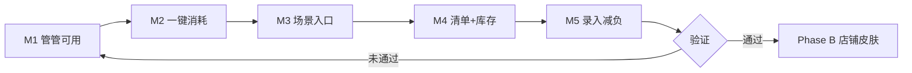

# 产品方向决策：先家庭，后小店

**日期**：2026-07-03  
**状态**：已确认方向（先单线打穿，再扩展）  
**关联**：[`20260703_scenario_map_family_and_shop.md`](./20260703_scenario_map_family_and_shop.md)

---

## 一、决策结论

| 项目 | 选择 |
|------|------|
| **Phase A 唯一主攻方向** | **家庭物品管理** |
| **Phase B 扩展方向** | 小店铺 / 轻量库存（`space_type=shop` 皮肤） |
| **原则** | 一套内核，不换 App；先让家庭用户 **每天用得上**，再复制工作流到小店 |

**不采用**：家庭与小店两条线并行开发、两套 UI、两套数据模型。

---

## 二、为什么先家庭

1. **现状对齐**：产品名、文案、Family 模型、提醒语义、管管意图均以家庭为主。  
2. **验证核心矛盾**：「录入成本 vs 有用」在家庭场景最典型 — 打穿后小店自然受益。  
3. **小店是增量皮肤**：条码、进价、库存、记录已有；延后 **售价/日销/CSV** 不阻塞家庭 MVP。  
4. **管管/管管 IP**：温暖、管家气质与家庭更贴；店铺扩展时加词表即可。

---

## 三、Phase A 范围（家庭 — 只做这些）

### 3.1 北极星

> 用户能在 **10 秒内** 回答：家里某样东西 **在哪、还剩多少、要不要处理**。

### 3.2 In Scope（6 个月内优先）

| # | 能力 | 说明 |
|---|------|------|
| A1 | **问管管** | 查询类 + 管管形象/动效；写操作引导到「+」 |
| A2 | **一键消耗** | 物品详情大按钮「用了 1」 |
| A3 | **场景入口** | 首页/空间：厨房、卫生间等快捷视图 |
| A4 | **清单带库存** | 购物清单项旁显示「现有 x」 |
| A5 | **临期/低库存闭环** | 提醒 → 处理 → 可选加清单 |
| A6 | **录入减负** | 扫码 + 向导；NL 预填（规则优先） |

### 3.3 Out of Scope（明确不做，等 Phase B）

| 能力 | 原因 |
|------|------|
| 售价 / 日销 / 毛利报表 | 店铺口径 |
| CSV 批量导入导出 | 店铺主诉求，家庭次之 |
| `space_type=shop` onboarding | Phase B 一次上线 |
| 供应商 / 采购分单 | 店铺 |
| 外借 / 隐私空间 | 重要但非 A 阶段阻塞，可 P1.5 单独立项 |
| 完整 ERP / 收银对接 | 永不作为目标 |

---

## 四、Phase B 预告（不现在做）

当 Phase A 满足 **留存或周活** 验证后（见下），再开：

1. 注册增加 **「小店铺 / 库存」**  
2. 字段：`sale_price`、`supplier`（评估迁移）  
3. 文案：消耗→卖出，购物→采购  
4. 统计：日销、简易进销  
5. 管管词表：断货、进货、还剩几箱  

**内核零分叉**：仍是一个 `Family` 租户 = 一个空间（家或店）。

---

## 五、Phase A 里程碑（建议顺序）

| 里程碑 | 交付 | 验收 |
|--------|------|------|
| **M1** | 管管查询 + 首页入口 + hello 序列帧（可选） | 5 类问题有结果 |
| **M2** | 物品详情「用了 1」 | 3 秒内完成消耗 | ✅ 已实现 |
| **M3** | 首页空间 Chip / 厨房聚合 | 少点 2 次进列表 | ✅ 已实现 |
| **M4** | 购物清单显示现有量 | 采购前不重复买 |
| **M5** | 规则 NL 预填入库 | 一句话进向导 |

---

## 六、Phase B 启动条件（Gate）

满足 **任一** 再开店铺线：

- 家庭空间 **≥10 个真实物品** 的活跃用户占比达标（内部定阈值，如 30%）  
- 或 主动反馈/调研中出现 **小店主误用家庭版且愿付费** 的明确需求  
- 或 M1～M4 已 ship 且 **2 周无 P0 bug**

---

## 七、对研发的一句话

> **接下来所有功能 PRD 默认读者是「家庭用户」；代码里避免写死「家庭」字样时用 `space` / `tenant`；小店仅预留扩展点，不实现店铺 UI。**

---

## 八、文档与愿景

- 产品愿景 [`doc/product/vision.md`](../../doc/product/vision.md) 仍以家庭为主标题，文末可加一句「远期支持小微库存」。  
- 场景全景见 [`20260703_scenario_map_family_and_shop.md`](./20260703_scenario_map_family_and_shop.md)，**执行以本文为准**。
