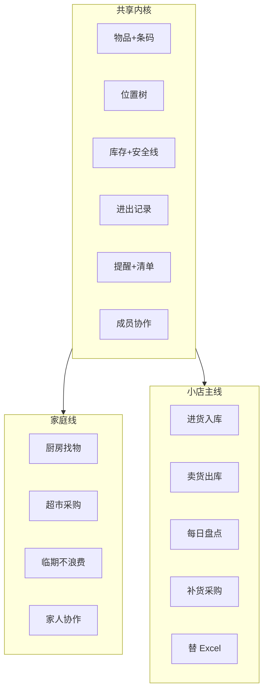

# HomeStock 真实场景地图 — 家庭 + 小店主（面向所有人）

**日期**：2026-07-03  
**状态**：产品规划参考  
**定位扩展**：不仅是「家庭物品管家」，也是 **小体量库存的轻量替代品** — 替 Excel / 死板 PC 表格，手机就能记、就能提醒、就能协作。

---

## 一、产品一句话（扩展版）

> **管清楚「空间里有什么、在哪、还剩多少、什么时候该补」** —  
> 空间可以是 **家**，也可以是 **小卖部 / 工作室 / 仓库一角**。

底层模型已具备：`物品`、`位置`、`库存`、`进销记录`、`成员协作`、`条码`、`进价`、`安全库存`。  
差异主要在 **话术、默认分类、报表口径、工作流入口**，而非重做一套 ERP。

---

## 二、两类用户，同一内核

| 维度 | 家庭用户 | 小店主 / 个体户 |
|------|----------|-----------------|
| **空间** | 家、厨房、卫生间 | 店、货架、库房、柜台 |
| **「组织」** | 家庭 | 店铺（可复用 Family 租户） |
| **成员** | 家人 | 老板、店员、合伙人 |
| **入库** | 买菜、网购到货 | 进货、收货、拆箱上架 |
| **出库** | 消耗、丢弃 | 卖出、损耗、试吃 |
| **补货** | 购物清单 | 采购清单 / 补货单 |
| **最怕** | 找不到、过期、重复买 | 断货、压货、对不上账 |
| **Excel 痛点** | 没人愿意打开电脑记 | 只能坐收银台后头改，手机改不了 |
| **成功标准** | 10 秒找到、少浪费 | 10 秒查库存、少盘错、知道该进啥 |

**共享能力（已有或接近已有）**：扫码、分类、位置树、库存、消耗/使用记录、临期/低库存提醒、购物清单、统计、多人同步、管管问答。

**需 persona 化（未完全）**：售价/毛利、进货批次、供应商、营业报表、CSV 导入导出、店铺话术与模板。

---

## 三、场景地图总览



---

## 四、家庭线 — 四条动线

### 4.1 厨房 / 在家找东西

| 真实瞬间 | 用户要什么 | 现状 | 缺口 | 难度 |
|----------|------------|------|------|------|
| 站在冰箱前 | 这里还有啥、啥快坏 | 空间查询、临期 | **「我在厨房」一键视图** | ⭐ 简单 |
| 做饭手脏 | 减 1 不用填表 | 消耗记录 | **详情页一键消耗** | ⭐ 简单 |
| 找调料 | 3 秒搜到 | 搜索 | 常搜/最近访问 | ⭐ 简单 |
| 问一句 | 管管「酱油在哪」 | Phase1 已有 | 口语/别名增强 | ⭐⭐ |

### 4.2 超市 / 采购前

| 真实瞬间 | 用户要什么 | 现状 | 缺口 | 难度 |
|----------|------------|------|------|------|
| 进超市 | 买啥、买多少 | 购物清单、推荐 | **按品类/动线排序** | ⭐⭐ |
| 看到促销 | 家里还有吗 | 搜索 | 清单项旁显示「现有 x」 | ⭐⭐ |
| 买完回家 | 快速入库 | 录入向导 | 语音/小票批量（规划） | ⭐⭐⭐ |

### 4.3 整理 / 控乱

| 真实瞬间 | 用户要什么 | 现状 | 缺口 | 难度 |
|----------|------------|------|------|------|
| 大扫除 | 这批放哪 | 位置、移动记录 | 批量改位置 | ⭐⭐⭐ |
| Seasonal | 冬装/露营在哪 | 分类+位置 | 季节标签+年度提醒 | ⭐⭐ |
| 数据乱了 | 和 reality 对齐 | 盘点任务 | 管管带盘点流程 | ⭐⭐⭐ |

### 4.4 家庭协作 / 情绪

| 真实瞬间 | 用户要什么 | 现状 | 缺口 | 难度 |
|----------|------------|------|------|------|
| 谁买的谁补 | 贡献可见 | 家庭贡献 | 日常「谁录入/谁消耗」 | ⭐⭐ |
| 借给邻居 | 不在库但还占账 | 弱 | **外借状态+归还提醒** | ⭐⭐ |
| 不想全家看见 | 私人物品 | 弱 | 可见性权限 | ⭐⭐⭐⭐ |

---

## 五、小店主线 — 五条动线（替 Excel）

### 5.1 进货 / 收货（= 家庭「入库」）

| 真实瞬间 | 老板要什么 | Excel 的问题 | App 可怎么做 | 难度 |
|----------|------------|--------------|--------------|------|
| 批发市场回来 | 一批货记进系统 | 回家才能开电脑 | 手机扫码连续录入 | ⭐⭐ 已有扫码 |
| 同品多箱 | 箱/件换算 | 公式易错 | 包装单位（部分已有） | ⭐⭐⭐ |
| 记进价 | 成本心里有数 | 列太多懒得填 | **进价+默认售价**（售价待补） | ⭐⭐ |
| 供应商 | 下次还找谁家 | 无结构化 | 供应商字段+筛选 | ⭐⭐ |
| 整单导入 | 几十 SKU | 复制粘贴地狱 | **CSV/表格导入** | ⭐⭐⭐ |

### 5.2 卖货 / 出库（= 家庭「消耗」）

| 真实瞬间 | 老板要什么 | Excel 的问题 | App 可怎么做 | 难度 |
|----------|------------|--------------|--------------|------|
| 卖出一瓶 | 库存减 1 | 忘了改表 | 扫码或搜名 **一键出库** | ⭐ 简单 |
| 忙时 | 极快 | 找不到行 | 最近卖出 / 热销快捷 | ⭐⭐ |
| 损耗过期 | 要扣库存 | 和卖出混在一起 | 出库类型：销售/损耗/过期 | ⭐⭐ 类型已有 |
| 卖多少钱 | 今日营业额 | 要另张表算 | **出库价×数量→日销** | ⭐⭐⭐ |

### 5.3 查库存 / 答客户（= 家庭「在哪、还有多少」）

| 真实瞬间 | 老板要什么 | Excel 的问题 | App 可怎么做 | 难度 |
|----------|------------|--------------|--------------|------|
| 客户问有没有 | 立刻答 | 翻表慢 | 搜索+条码+管管 | ⭐ 已有 |
| 找货 | 在后库哪架 | 位置列不维护 | **货架位置树**（= 位置） | ⭐ 已有 |
| 快断货 | 别卖超 | 无推送 | 低库存提醒 | ⭐ 已有 |

### 5.4 补货 / 采购（= 购物清单）

| 真实瞬间 | 老板要什么 | Excel 的问题 | App 可怎么做 | 难度 |
|----------|------------|--------------|--------------|------|
| 周末进货 | 缺啥列清单 | 手工加行 | 低库存→采购清单 | ⭐⭐ |
| 按供应商 | 分单采购 | 筛选麻烦 | 清单按供应商分组 | ⭐⭐⭐ |
| 预估金额 | 带多少钱 | 要 VLOOKUP | 清单预估进价合计 | ⭐⭐ |

### 5.5 盘点 / 对账（= 家庭盘点 + Excel 月末噩梦）

| 真实瞬间 | 老板要什么 | Excel 的问题 | App 可怎么做 | 难度 |
|----------|------------|--------------|--------------|------|
| 打烊盘点 | 账实相符 | 打印纸+人工勾 | **盘点任务**（已有） | ⭐⭐ |
| 差 3 件 | 知道差在哪 | 无 diff | 盘点 diff 报告 | ⭐⭐⭐ |
| 月底汇总 | 进了多少卖了多少 | 多 sheet 汇总 | **进销存简易报表** | ⭐⭐⭐ |
| 报税备查 | 导出 | 格式乱 | CSV 导出 | ⭐⭐ |

---

## 六、Excel vs HomeStock — 小店主为什么可能换

| Excel / 死板 PC | HomeStock 轻量优势 |
|-----------------|---------------------|
| 必须坐在电脑前改 | 手机随时改 |
| 无自动提醒 | 低库存、临期推送 |
| 多人改易覆盖 | 家庭/店铺成员同步 |
| 无扫码 | 条码录入+查价 |
| 公式脆弱 | 预测消耗（服务端已有） |
| 无「问一句」 | 管管：「可乐还剩几箱」 |

**不是取代 ERP/收银系统**，而是 **10～500 SKU 的小微场景**：小卖部、便利店、工作室耗材、夜市摊、家庭作坊。

---

## 七、面向「所有人」的产品策略

### 7.1 注册 /  onboarding 选空间类型

```
你主要管理什么？
  [ 家庭物品 ]  [ 小店铺 / 库存 ]
       ↓              ↓
  默认分类：食品…    默认分类：烟酒…
  话术：家、厨房      话术：店、货架
  提醒：临期优先      提醒：断货优先
```

**实现**：同一 `Family` 租户 + `space_type` 配置 + 预设模板，不必两套 App。

### 7.2 共享 vs 分岔

| 能力 | 共享 | 家庭加强 | 店铺加强 |
|------|------|----------|----------|
| 物品/位置/库存 | ✅ | 存放照片 | 货架编号 |
| 进出记录 | ✅ | 「消耗」 | 「销售/损耗」 |
| 清单 | ✅ | 购物 | 采购单 |
| 统计 | ✅ | 浪费、分类消费 | 日销、毛利、周转 |
| 管管 | ✅ | 厨房有什么 | 还剩几箱、今日卖啥 |
| 协作 | ✅ | 家人贡献 | 店员权限 |

### 7.3 话术与 UI 示例

| 概念 | 家庭 | 店铺 |
|------|------|------|
| 组织 | 我的家庭 | 我的店 |
| 入库 | 添加入库 | 进货 |
| 出库 | 记录消耗 | 卖出 / 出库 |
| 位置 | 厨房→冰箱 | 店面→A 架→第二层 |
| 清单 | 购物清单 | 采购清单 |
| 管管 | 「牛奶在哪」 | 「红牛还剩多少」 |

---

## 八、缺口优先级（双 persona 合并）

| 优先级 | 能力 | 家庭价值 | 店铺价值 | 难度 |
|--------|------|----------|----------|------|
| **P0** | 一键出库/消耗 | ⭐⭐⭐ | ⭐⭐⭐ | ⭐ |
| **P0** | 场景入口（空间/店型首页） | ⭐⭐⭐ | ⭐⭐⭐ | ⭐ |
| **P0** | 空间类型 onboarding | ⭐⭐ | ⭐⭐⭐ | ⭐⭐ |
| **P1** | 清单显示「现有库存」 | ⭐⭐⭐ | ⭐⭐⭐ | ⭐⭐ |
| **P1** | 售价 + 简易日销统计 | ⭐ | ⭐⭐⭐ | ⭐⭐⭐ |
| **P1** | CSV 导入/导出 | ⭐ | ⭐⭐⭐ | ⭐⭐⭐ |
| **P1** | 供应商字段 | ⭐ | ⭐⭐⭐ | ⭐⭐ |
| **P2** | 外借 / 在途 | ⭐⭐⭐ | ⭐ | ⭐⭐ |
| **P2** | 管管 + Insight 推送 | ⭐⭐⭐ | ⭐⭐⭐ | ⭐⭐⭐ |
| **P2** | 语音/小票批量入库 | ⭐⭐⭐ | ⭐⭐⭐ | ⭐⭐⭐⭐ |

---

## 九、管管在不同 persona 的「第一句话」

| 家庭 | 小店主 |
|------|--------|
| 厨房有什么 | 今天卖了哪些 |
| 什么快过期 | 什么快断货 |
| 牛奶在哪 | 红牛在哪架 |
| 有什么要处理 | 今天要补什么货 |
| 帮我记一下买了… | 进了 10 箱可乐… |

**同一套 Parser + Executor**，扩展意图与词表即可，不必两个 AI。

---

## 十、结论

1. **可以面向所有人**：内核是 **「轻量空间库存」**，家庭与小店是两种 **工作流皮肤**。  
2. **小店主不是硬拗**：模型已有条码、进价、库存、记录、协作 — 差的是 **售价/报表/导入/店铺话术**。  
3. **比 Excel 赢在手机、提醒、协作、扫码、问答** — 不是赢在复杂报表。  
4. **先做 P0**（一键出库、场景首页、选家庭/店铺）两边用户都会立刻觉得「懂我」。

---

## 十一、建议下一步（产品）

1. PRD 补 **`space_type`: `home` | `shop`** 与 onboarding 分叉  
2. 盘点 **店铺默认分类/位置模板**  
3. 物品表评估 **`sale_price` / `supplier`** 字段  
4. 管管词表加 **「卖出」「进货」「断货」** 等店铺说法  

关联文档：[`20260703_ai_mascot_character_design.md`](./20260703_ai_mascot_character_design.md)、[`20260702_ai_assistant_mvp_plan.md`](./20260702_ai_assistant_mvp_plan.md)
