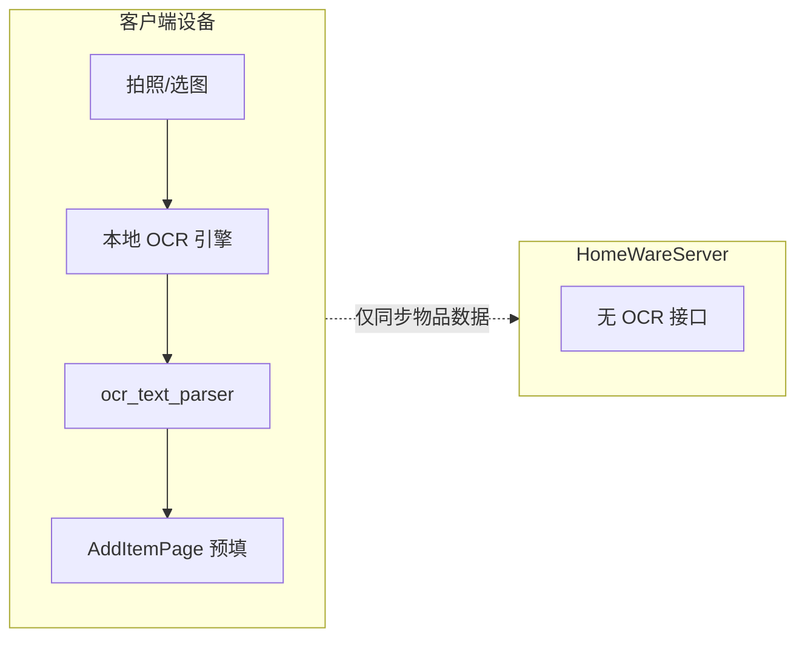

# OCR 技术决策：纯端侧、零服务器成本

**日期**：2026-07-02  
**状态**：已确认（产品约束）  
**关联**：[`20260702_phase_a_d_b_execution_plan.md`](20260702_phase_a_d_b_execution_plan.md) Phase B

---

## 决策摘要

考虑到 **服务器与各项运营成本**，OCR 能力 **不采用** 以下方案：

| 方案 | 状态 |
|------|------|
| 第三方云 OCR API（百度 / Azure / 腾讯云等） | ❌ 不做 |
| 自建服务端 OCR 转发 / `POST /api/v1/ocr/*` | ❌ 不做 |
| 服务端算力跑 PaddleOCR / Tesseract 等 | ❌ 不做 |

**唯一方向**：后期优先评估 **客户端本地模型**，识别在设备上完成，不上传图片、不增加后端负担。

当前录入方式页「拍照识别」保持 **disabled 占位**（`add_item_method_page.dart`），待本地方案成熟后再启用。

---

## 推荐技术路线（按优先级）

### 1. MVP：Google ML Kit Text Recognition（Android / iOS）

- **依赖**：`google_mlkit_text_recognition`（模型随 SDK 下发，**离线可用**）
- **成本**：无按次计费；包体约 +10～15MB
- **流程**：`image_picker` 选图 → ML Kit 识别 → `ocr_text_parser` 启发式提取名称/品牌/条码 → 跳转 `/items/add` 预填
- **平台**：Android / iOS 为主；Windows / Web / 桌面 **降级提示**「请使用扫码或手动向导」

### 2. 增强（可选）：端侧小模型

若 ML Kit 对中文包装、小票识别率不足，再调研：

| 选项 | 说明 | 备注 |
|------|------|------|
| **ML Kit 中文模型** | 部分语言包需单独下载 | 仍属端侧 |
| **TFLite / ONNX 轻量 OCR** | 自训练或开源权重打包进 App | 包体与维护成本更高 |
| **Apple Vision / Android ML** | 平台原生 API | 需分平台封装 |

**原则**：模型文件随 App 或按需下载到 **本地**，识别过程 **不出设备**。

### 3. 明确不做

- 图片上传至 HomeWareServer 做 OCR
- 任何需要 API Key、按量计费的云服务
- 为 OCR 单独部署 GPU / Celery 任务

---

## 架构示意

---

## 与现有能力衔接

| 能力 | 说明 |
|------|------|
| 扫码 | 已有条码扫描 + `BarcodeService.lookup` 补强品名/品牌 |
| 手动向导 | OCR 失败或未支持平台时 fallback |
| 草稿 | OCR 确认前进向导，不写入 draft |

---

## 实施节奏（低优先级）

| 顺序 | 任务 | 说明 |
|------|------|------|
| 1 | `ocr_text_parser.dart` + 单元测试 | 无设备依赖，可先写 |
| 2 | `ocr_service.dart`（ML Kit 封装） | 仅 mobile 编译依赖 |
| 3 | `ocr_capture_page.dart` + 路由 | 启用录入方式页入口 |
| 4 | 真机样本集验证 | 包装正面 / 小票 / 模糊图 |

**触发条件**：Phase A 验证 + Phase D 消耗估算联调完成后再排期；不阻塞当前迭代。

---

## 提测关注点（未来启用时）

1. Android / iOS 离线识别（飞行模式）是否正常  
2. 识别结果可编辑，失败不 crash，可转手动向导  
3. Windows / Web 点击「拍照识别」仅提示，不引入 ML Kit 依赖  
4. 确认 **无** 图片上传 OCR 相关网络请求（Charles / 日志抽查）

---

## 变更记录

| 日期 | 说明 |
|------|------|
| 2026-07-02 | 产品确认：零三方 API、零服务端 OCR，优先本地模型 |